## This assignment is about Session 11 - Class Activation Maps, LRs and Optimizers

# Our Assignment was to
1. Check this Repo out: https://github.com/kuangliu/pytorch-cifar
2. (Optional) You are going to follow the same structure for your Code (as a reference). So Create:
  1. models folder - this is where you'll add all of your future models. Copy resnet.py into this folder, this file should only have ResNet 18/34 models. Delete Bottleneck Class
  2. main.py - from Google Colab, now onwards, this is the file that you'll import (along with the model). Your main file shall be able to take these params or you should be able to pull functions from it and then perform operations, like (including but not limited to):
    1. training and test loops
    2. data split between test and train
    3. epochs
    4. batch size
    5.which optimizer to run
    6. do we run a scheduler?
3. utils.py file (or a folder later on when it expands) - this is where you will add all of your utilities like:
  1. image transforms,
  2. gradcam,
  3. misclassification code,
  4. tensorboard related stuff
  5. advanced training policies, etc
  6. etc

### Have pull the utils.py, main.py and models.py file to my Assignment_11.ipynb notebook
### Inside utils.py file we have defined 
  1. Image transforms 
  2. Gradcam
  3. Misclassification code

### Inside main.py file we have defined
  1. training and testing loops
  2. data split between test and train

### Inside models.py folder we have made Assignment_11_models.py to defined our Resnet18 model architecture

We have train our Resnet18 model for 20 epochs, the maximum accuracy we got is 89.19% at epoch 20th

EPOCH: 20
Loss=0.6456969976425171 Batch_id=97 Accuracy=77.24: 100%|██████████████████████████████| 98/98 [00:48<00:00,  2.02it/s]

Test set: Average loss: 0.3286, Accuracy: 8919/10000 (89.19%)

# Below is 10 misclassified images

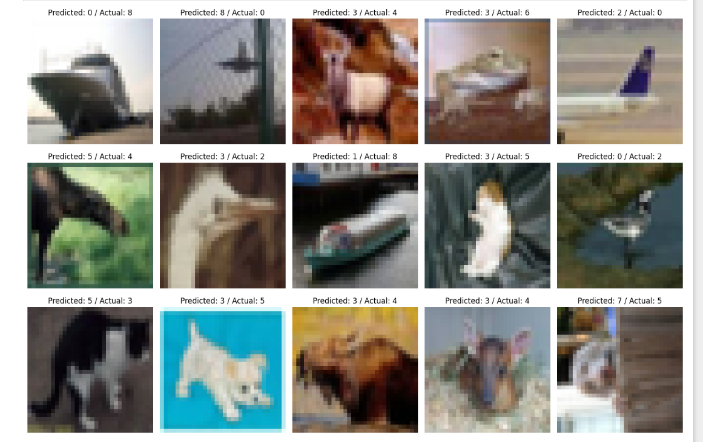

# Below is 10 Grad Cam images on 10 misclassified images
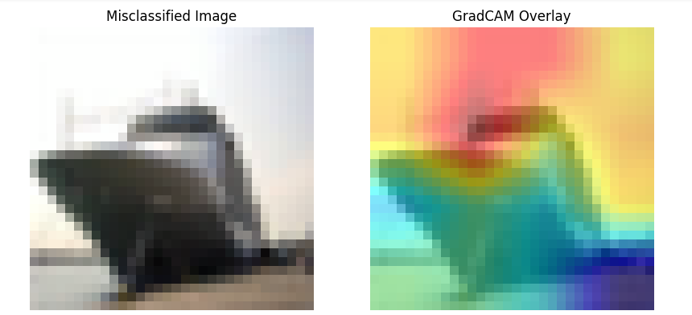
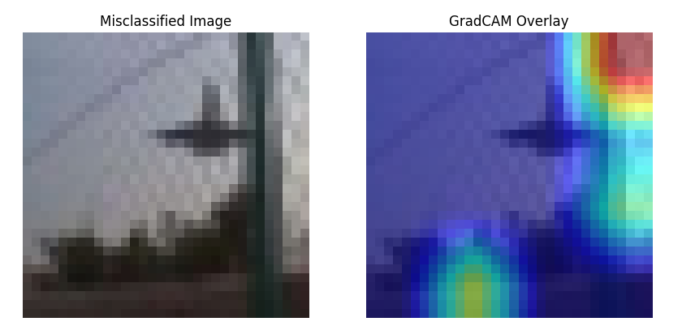
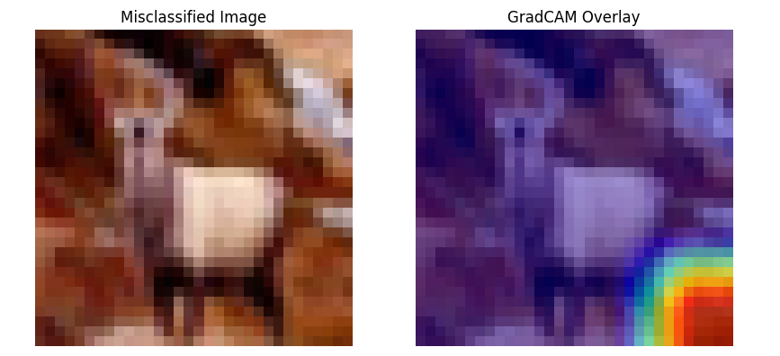
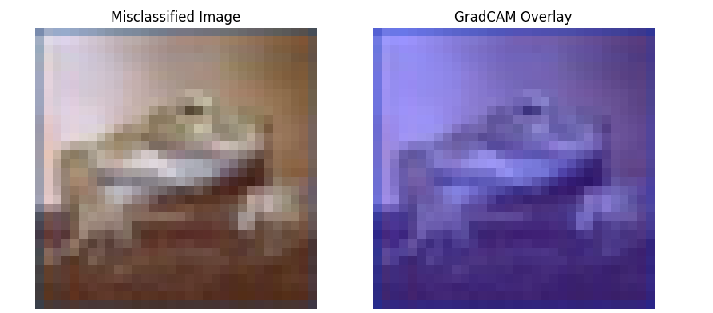
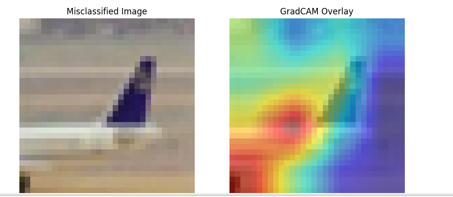
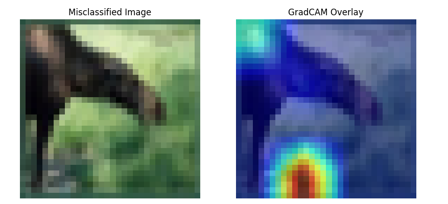
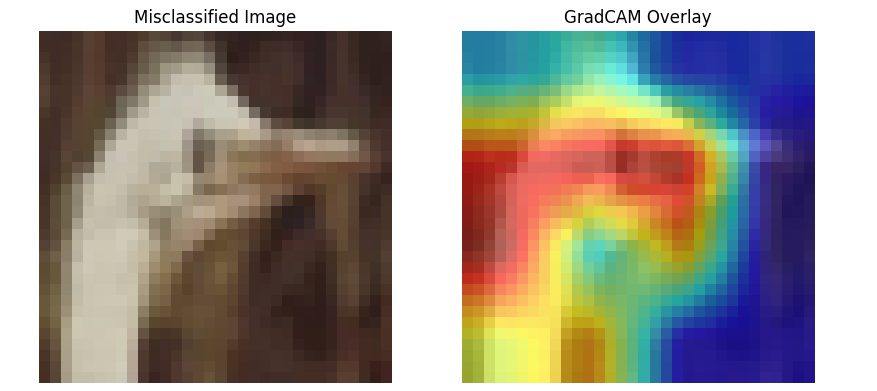
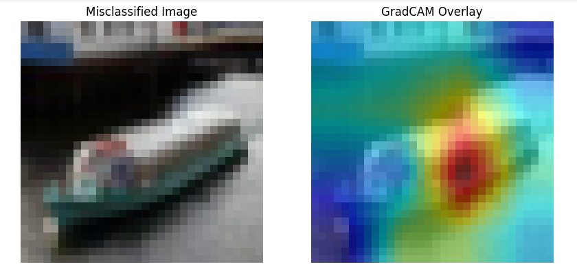
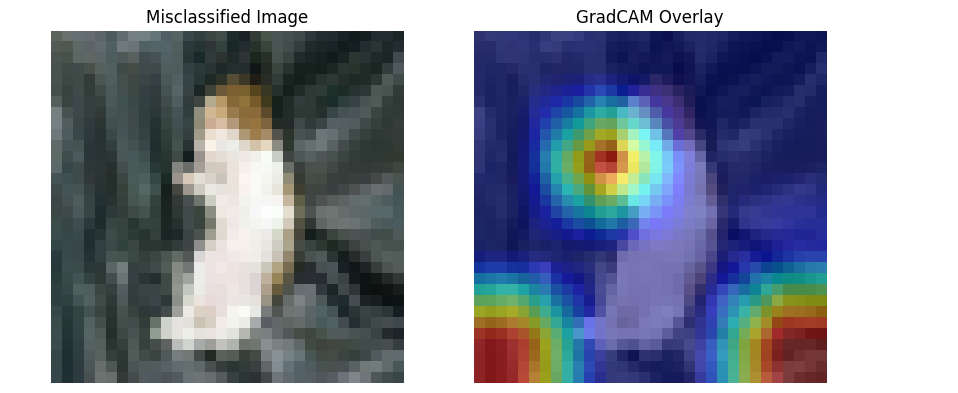
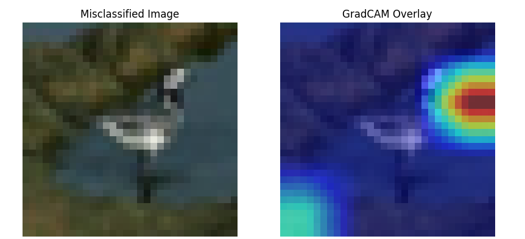
