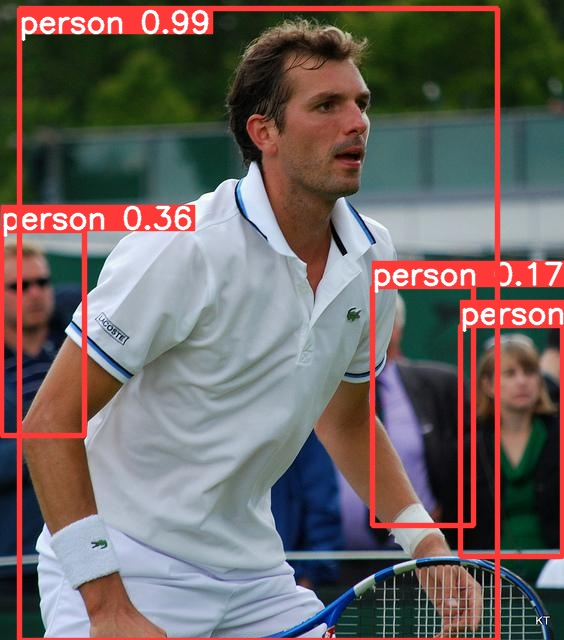

# This is the ERA V2 Phase 1 Computer Vision Capstone Project

In this capstone project we have to train a object detection on custom dataset. I have manually annotated 400 images of persons. The goal is to implement all the computer vision and deep learning techniques which we have learned till now

Technologies used

1. Python
2. PyTorch
3. YoloV9

About the project
In object detection, when we upload a image it will detect the particular object in that given image. For this project, i have trained my dataset on persons image means it will detect the location of the persons or humans in that particular image

Object Detection is a computer vision task in which the goal is to detect and locate objects of interest in an image or video. The task involves identifying the position and boundaries of objects in an image, and classifying the objects into different categories

Below is the training log 

```
Logging results to runs/train/exp
Starting training for 100 epochs...
/usr/lib/python3.10/multiprocessing/popen_fork.py:66: RuntimeWarning: os.fork() was called. os.fork() is incompatible with multithreaded code, and JAX is multithreaded, so this will likely lead to a deadlock.
  self.pid = os.fork()

      Epoch    GPU_mem   box_loss   cls_loss   dfl_loss  Instances       Size
       0/99      10.9G      1.442      2.053      1.626         80        640: 100% 16/16 [00:27<00:00,  1.71s/it]
                 Class     Images  Instances          P          R      mAP50   mAP50-95: 100% 2/2 [00:03<00:00,  1.76s/it]
                   all         64        139      0.861      0.933      0.927      0.531
/usr/lib/python3.10/multiprocessing/popen_fork.py:66: RuntimeWarning: os.fork() was called. os.fork() is incompatible with multithreaded code, and JAX is multithreaded, so this will likely lead to a deadlock.
  self.pid = os.fork()

      Epoch    GPU_mem   box_loss   cls_loss   dfl_loss  Instances       Size
       1/99      13.3G      1.337     0.9471      1.465         99        640: 100% 16/16 [00:17<00:00,  1.11s/it]
                 Class     Images  Instances          P          R      mAP50   mAP50-95: 100% 2/2 [00:01<00:00,  1.53it/s]
                   all         64        139      0.875       0.95      0.899      0.546

      Epoch    GPU_mem   box_loss   cls_loss   dfl_loss  Instances       Size
       2/99      13.3G      1.243     0.8537      1.416         82        640: 100% 16/16 [00:17<00:00,  1.08s/it]
                 Class     Images  Instances          P          R      mAP50   mAP50-95: 100% 2/2 [00:01<00:00,  1.56it/s]
                   all         64        139      0.923      0.949      0.974      0.656

      Epoch    GPU_mem   box_loss   cls_loss   dfl_loss  Instances       Size
       3/99      13.3G      1.211     0.8893      1.395         70        640: 100% 16/16 [00:17<00:00,  1.08s/it]
                 Class     Images  Instances          P          R      mAP50   mAP50-95: 100% 2/2 [00:01<00:00,  1.53it/s]
                   all         64        139      0.916      0.947      0.956      0.606

      Epoch    GPU_mem   box_loss   cls_loss   dfl_loss  Instances       Size
       4/99      13.3G      1.191     0.7589      1.369         78        640: 100% 16/16 [00:17<00:00,  1.08s/it]
                 Class     Images  Instances          P          R      mAP50   mAP50-95: 100% 2/2 [00:01<00:00,  1.53it/s]
                   all         64        139      0.943      0.906      0.975      0.614

      Epoch    GPU_mem   box_loss   cls_loss   dfl_loss  Instances       Size
       5/99      13.3G      1.252     0.7919      1.431         77        640: 100% 16/16 [00:16<00:00,  1.04s/it]
                 Class     Images  Instances          P          R      mAP50   mAP50-95: 100% 2/2 [00:01<00:00,  1.53it/s]
                   all         64        139      0.886      0.949      0.938      0.567

      Epoch    GPU_mem   box_loss   cls_loss   dfl_loss  Instances       Size
       6/99      13.3G       1.23     0.8464       1.42         93        640: 100% 16/16 [00:17<00:00,  1.06s/it]
                 Class     Images  Instances          P          R      mAP50   mAP50-95: 100% 2/2 [00:01<00:00,  1.46it/s]
                   all         64        139      0.902      0.859      0.929      0.561

      Epoch    GPU_mem   box_loss   cls_loss   dfl_loss  Instances       Size
       7/99      13.3G      1.243     0.8098      1.455        108        640: 100% 16/16 [00:15<00:00,  1.01it/s]
                 Class     Images  Instances          P          R      mAP50   mAP50-95: 100% 2/2 [00:01<00:00,  1.50it/s]
                   all         64        139      0.901      0.851      0.945       0.59

      Epoch    GPU_mem   box_loss   cls_loss   dfl_loss  Instances       Size
       8/99      13.3G      1.268     0.8456       1.43         82        640: 100% 16/16 [00:15<00:00,  1.04it/s]
                 Class     Images  Instances          P          R      mAP50   mAP50-95: 100% 2/2 [00:01<00:00,  1.49it/s]
                   all         64        139      0.757      0.763      0.815      0.445

      Epoch    GPU_mem   box_loss   cls_loss   dfl_loss  Instances       Size
       9/99      13.3G       1.29     0.8326      1.416         85        640: 100% 16/16 [00:16<00:00,  1.02s/it]
                 Class     Images  Instances          P          R      mAP50   mAP50-95: 100% 2/2 [00:01<00:00,  1.50it/s]
                   all         64        139      0.785      0.856      0.842      0.435

      Epoch    GPU_mem   box_loss   cls_loss   dfl_loss  Instances       Size
      10/99      13.3G      1.308     0.8342      1.453        118        640: 100% 16/16 [00:15<00:00,  1.01it/s]
                 Class     Images  Instances          P          R      mAP50   mAP50-95: 100% 2/2 [00:01<00:00,  1.48it/s]
                   all         64        139      0.823      0.842      0.873      0.488

      Epoch    GPU_mem   box_loss   cls_loss   dfl_loss  Instances       Size
      11/99      13.3G      1.345     0.9547      1.489        111        640: 100% 16/16 [00:15<00:00,  1.02it/s]
                 Class     Images  Instances          P          R      mAP50   mAP50-95: 100% 2/2 [00:01<00:00,  1.46it/s]
                   all         64        139      0.765      0.856      0.878      0.474

      Epoch    GPU_mem   box_loss   cls_loss   dfl_loss  Instances       Size
      12/99      13.3G      1.294     0.8894      1.431         79        640: 100% 16/16 [00:15<00:00,  1.03it/s]
                 Class     Images  Instances          P          R      mAP50   mAP50-95: 100% 2/2 [00:01<00:00,  1.47it/s]
                   all         64        139      0.834      0.759      0.862      0.472

      Epoch    GPU_mem   box_loss   cls_loss   dfl_loss  Instances       Size
      13/99      13.3G      1.307     0.8937      1.436         78        640: 100% 16/16 [00:16<00:00,  1.00s/it]
                 Class     Images  Instances          P          R      mAP50   mAP50-95: 100% 2/2 [00:01<00:00,  1.49it/s]
                   all         64        139      0.769      0.835      0.851      0.442

      Epoch    GPU_mem   box_loss   cls_loss   dfl_loss  Instances       Size
      14/99      13.3G      1.329     0.9424      1.482        104        640: 100% 16/16 [00:15<00:00,  1.01it/s]
                 Class     Images  Instances          P          R      mAP50   mAP50-95: 100% 2/2 [00:01<00:00,  1.53it/s]
                   all         64        139      0.743      0.849      0.845      0.445

      Epoch    GPU_mem   box_loss   cls_loss   dfl_loss  Instances       Size
      15/99      13.3G      1.265     0.8828      1.419        100        640: 100% 16/16 [00:15<00:00,  1.01it/s]
                 Class     Images  Instances          P          R      mAP50   mAP50-95: 100% 2/2 [00:01<00:00,  1.50it/s]
                   all         64        139      0.841      0.875      0.884      0.476

      Epoch    GPU_mem   box_loss   cls_loss   dfl_loss  Instances       Size
      16/99      13.3G      1.308     0.9333      1.478         79        640: 100% 16/16 [00:16<00:00,  1.00s/it]
                 Class     Images  Instances          P          R      mAP50   mAP50-95: 100% 2/2 [00:01<00:00,  1.47it/s]
                   all         64        139       0.91      0.801      0.899      0.456

      Epoch    GPU_mem   box_loss   cls_loss   dfl_loss  Instances       Size
      17/99      13.3G      1.275     0.9153      1.466         99        640: 100% 16/16 [00:15<00:00,  1.02it/s]
                 Class     Images  Instances          P          R      mAP50   mAP50-95: 100% 2/2 [00:01<00:00,  1.48it/s]
                   all         64        139      0.806      0.784      0.801      0.394

      Epoch    GPU_mem   box_loss   cls_loss   dfl_loss  Instances       Size
      18/99      13.3G      1.279     0.8451      1.443         80        640: 100% 16/16 [00:15<00:00,  1.01it/s]
                 Class     Images  Instances          P          R      mAP50   mAP50-95: 100% 2/2 [00:01<00:00,  1.52it/s]
                   all         64        139      0.779      0.763      0.749      0.358

      Epoch    GPU_mem   box_loss   cls_loss   dfl_loss  Instances       Size
      19/99      13.3G       1.31     0.9301      1.465         65        640: 100% 16/16 [00:14<00:00,  1.08it/s]
                 Class     Images  Instances          P          R      mAP50   mAP50-95: 100% 2/2 [00:01<00:00,  1.49it/s]
                   all         64        139      0.797      0.777      0.846      0.409

      Epoch    GPU_mem   box_loss   cls_loss   dfl_loss  Instances       Size
      20/99      13.3G      1.322     0.9382      1.488         87        640: 100% 16/16 [00:15<00:00,  1.01it/s]
                 Class     Images  Instances          P          R      mAP50   mAP50-95: 100% 2/2 [00:01<00:00,  1.50it/s]
                   all         64        139      0.685      0.798        0.7      0.347

      Epoch    GPU_mem   box_loss   cls_loss   dfl_loss  Instances       Size
      21/99      13.3G      1.278     0.9012      1.469         62        640: 100% 16/16 [00:15<00:00,  1.04it/s]
                 Class     Images  Instances          P          R      mAP50   mAP50-95: 100% 2/2 [00:01<00:00,  1.51it/s]
                   all         64        139      0.828      0.799      0.866      0.464

      Epoch    GPU_mem   box_loss   cls_loss   dfl_loss  Instances       Size
      22/99      13.3G      1.258     0.8464       1.45         83        640: 100% 16/16 [00:15<00:00,  1.04it/s]
                 Class     Images  Instances          P          R      mAP50   mAP50-95: 100% 2/2 [00:01<00:00,  1.50it/s]
                   all         64        139      0.705      0.813      0.763      0.366

      Epoch    GPU_mem   box_loss   cls_loss   dfl_loss  Instances       Size
      23/99      13.3G      1.276     0.8728      1.471         94        640: 100% 16/16 [00:15<00:00,  1.01it/s]
                 Class     Images  Instances          P          R      mAP50   mAP50-95: 100% 2/2 [00:01<00:00,  1.49it/s]
                   all         64        139      0.753      0.791      0.825       0.45

      Epoch    GPU_mem   box_loss   cls_loss   dfl_loss  Instances       Size
      24/99      13.3G       1.31     0.9091      1.473         83        640: 100% 16/16 [00:15<00:00,  1.03it/s]
                 Class     Images  Instances          P          R      mAP50   mAP50-95: 100% 2/2 [00:01<00:00,  1.49it/s]
                   all         64        139      0.802      0.806      0.856      0.461

      Epoch    GPU_mem   box_loss   cls_loss   dfl_loss  Instances       Size
      25/99      13.3G       1.28     0.8448      1.439        116        640: 100% 16/16 [00:15<00:00,  1.04it/s]
                 Class     Images  Instances          P          R      mAP50   mAP50-95: 100% 2/2 [00:01<00:00,  1.46it/s]
                   all         64        139      0.899      0.763      0.863       0.45

      Epoch    GPU_mem   box_loss   cls_loss   dfl_loss  Instances       Size
      26/99      13.3G      1.214     0.8139       1.44         91        640: 100% 16/16 [00:16<00:00,  1.02s/it]
                 Class     Images  Instances          P          R      mAP50   mAP50-95: 100% 2/2 [00:01<00:00,  1.51it/s]
                   all         64        139       0.87       0.77      0.866      0.467

      Epoch    GPU_mem   box_loss   cls_loss   dfl_loss  Instances       Size
      27/99      13.3G      1.261     0.8294      1.455        100        640: 100% 16/16 [00:15<00:00,  1.04it/s]
                 Class     Images  Instances          P          R      mAP50   mAP50-95: 100% 2/2 [00:01<00:00,  1.51it/s]
                   all         64        139      0.865      0.785      0.868      0.482

      Epoch    GPU_mem   box_loss   cls_loss   dfl_loss  Instances       Size
      28/99      13.3G       1.23     0.8414      1.402         83        640: 100% 16/16 [00:15<00:00,  1.02it/s]
                 Class     Images  Instances          P          R      mAP50   mAP50-95: 100% 2/2 [00:01<00:00,  1.51it/s]
                   all         64        139      0.776      0.827      0.814      0.435

      Epoch    GPU_mem   box_loss   cls_loss   dfl_loss  Instances       Size
      29/99      13.3G      1.228     0.8243      1.418         60        640: 100% 16/16 [00:15<00:00,  1.02it/s]
                 Class     Images  Instances          P          R      mAP50   mAP50-95: 100% 2/2 [00:01<00:00,  1.51it/s]
                   all         64        139       0.85      0.842      0.834      0.441

      Epoch    GPU_mem   box_loss   cls_loss   dfl_loss  Instances       Size
      30/99      13.3G      1.219     0.8162       1.41         83        640: 100% 16/16 [00:15<00:00,  1.01it/s]
                 Class     Images  Instances          P          R      mAP50   mAP50-95: 100% 2/2 [00:01<00:00,  1.48it/s]
                   all         64        139       0.82      0.855      0.846      0.436

      Epoch    GPU_mem   box_loss   cls_loss   dfl_loss  Instances       Size
      31/99      13.3G      1.179     0.7997      1.356         81        640: 100% 16/16 [00:15<00:00,  1.00it/s]
                 Class     Images  Instances          P          R      mAP50   mAP50-95: 100% 2/2 [00:01<00:00,  1.48it/s]
                   all         64        139      0.862      0.827      0.858      0.479

      Epoch    GPU_mem   box_loss   cls_loss   dfl_loss  Instances       Size
      32/99      13.3G      1.211     0.8134       1.43         47        640: 100% 16/16 [00:15<00:00,  1.03it/s]
                 Class     Images  Instances          P          R      mAP50   mAP50-95: 100% 2/2 [00:01<00:00,  1.50it/s]
                   all         64        139      0.852      0.788      0.859      0.465

      Epoch    GPU_mem   box_loss   cls_loss   dfl_loss  Instances       Size
      33/99      13.3G      1.182     0.8218       1.38         77        640: 100% 16/16 [00:16<00:00,  1.01s/it]
                 Class     Images  Instances          P          R      mAP50   mAP50-95: 100% 2/2 [00:01<00:00,  1.48it/s]
                   all         64        139      0.835      0.838      0.867      0.491

      Epoch    GPU_mem   box_loss   cls_loss   dfl_loss  Instances       Size
      34/99      13.3G      1.189     0.8023      1.385         84        640: 100% 16/16 [00:16<00:00,  1.03s/it]
                 Class     Images  Instances          P          R      mAP50   mAP50-95: 100% 2/2 [00:01<00:00,  1.50it/s]
                   all         64        139      0.866      0.834      0.876       0.47

      Epoch    GPU_mem   box_loss   cls_loss   dfl_loss  Instances       Size
      35/99      13.3G      1.152     0.7845      1.369        110        640: 100% 16/16 [00:16<00:00,  1.02s/it]
                 Class     Images  Instances          P          R      mAP50   mAP50-95: 100% 2/2 [00:01<00:00,  1.47it/s]
                   all         64        139      0.853      0.799      0.847      0.469

      Epoch    GPU_mem   box_loss   cls_loss   dfl_loss  Instances       Size
      36/99      13.3G       1.14     0.7675      1.356         86        640: 100% 16/16 [00:15<00:00,  1.03it/s]
                 Class     Images  Instances          P          R      mAP50   mAP50-95: 100% 2/2 [00:01<00:00,  1.52it/s]
                   all         64        139      0.815      0.863      0.882       0.52

      Epoch    GPU_mem   box_loss   cls_loss   dfl_loss  Instances       Size
      37/99      13.3G      1.128     0.7444      1.343        114        640: 100% 16/16 [00:16<00:00,  1.04s/it]
                 Class     Images  Instances          P          R      mAP50   mAP50-95: 100% 2/2 [00:01<00:00,  1.51it/s]
                   all         64        139      0.864      0.867      0.899      0.516

      Epoch    GPU_mem   box_loss   cls_loss   dfl_loss  Instances       Size
      38/99      13.3G      1.109     0.7601      1.334         87        640: 100% 16/16 [00:15<00:00,  1.01it/s]
                 Class     Images  Instances          P          R      mAP50   mAP50-95: 100% 2/2 [00:01<00:00,  1.48it/s]
                   all         64        139      0.793       0.82      0.821      0.426

      Epoch    GPU_mem   box_loss   cls_loss   dfl_loss  Instances       Size
      39/99      13.3G      1.152     0.7837      1.365         91        640: 100% 16/16 [00:15<00:00,  1.00it/s]
                 Class     Images  Instances          P          R      mAP50   mAP50-95: 100% 2/2 [00:01<00:00,  1.50it/s]
                   all         64        139      0.813      0.847      0.856      0.469

      Epoch    GPU_mem   box_loss   cls_loss   dfl_loss  Instances       Size
      40/99      13.3G      1.174     0.7661      1.325         94        640: 100% 16/16 [00:16<00:00,  1.01s/it]
                 Class     Images  Instances          P          R      mAP50   mAP50-95: 100% 2/2 [00:01<00:00,  1.49it/s]
                   all         64        139      0.813      0.863      0.851       0.45

      Epoch    GPU_mem   box_loss   cls_loss   dfl_loss  Instances       Size
      41/99      13.3G      1.149     0.7593      1.375        129        640: 100% 16/16 [00:15<00:00,  1.01it/s]
                 Class     Images  Instances          P          R      mAP50   mAP50-95: 100% 2/2 [00:01<00:00,  1.54it/s]
                   all         64        139      0.833      0.863      0.899       0.49

      Epoch    GPU_mem   box_loss   cls_loss   dfl_loss  Instances       Size
      42/99      13.3G      1.074     0.7182      1.309         94        640: 100% 16/16 [00:16<00:00,  1.02s/it]
                 Class     Images  Instances          P          R      mAP50   mAP50-95: 100% 2/2 [00:01<00:00,  1.52it/s]
                   all         64        139      0.868      0.791      0.884      0.481

      Epoch    GPU_mem   box_loss   cls_loss   dfl_loss  Instances       Size
      43/99      13.3G      1.086     0.6789       1.31        109        640: 100% 16/16 [00:15<00:00,  1.03it/s]
                 Class     Images  Instances          P          R      mAP50   mAP50-95: 100% 2/2 [00:01<00:00,  1.47it/s]
                   all         64        139      0.904      0.799      0.887      0.491

      Epoch    GPU_mem   box_loss   cls_loss   dfl_loss  Instances       Size
      44/99      13.3G      1.109     0.7063       1.32         88        640: 100% 16/16 [00:15<00:00,  1.02it/s]
                 Class     Images  Instances          P          R      mAP50   mAP50-95: 100% 2/2 [00:01<00:00,  1.51it/s]
                   all         64        139      0.851       0.82      0.877      0.494

      Epoch    GPU_mem   box_loss   cls_loss   dfl_loss  Instances       Size
      45/99      13.3G      1.082     0.7309      1.324         82        640: 100% 16/16 [00:15<00:00,  1.03it/s]
                 Class     Images  Instances          P          R      mAP50   mAP50-95: 100% 2/2 [00:01<00:00,  1.49it/s]
                   all         64        139      0.852      0.813      0.857      0.455

      Epoch    GPU_mem   box_loss   cls_loss   dfl_loss  Instances       Size
      46/99      13.3G      1.046     0.6709      1.293         69        640: 100% 16/16 [00:15<00:00,  1.01it/s]
                 Class     Images  Instances          P          R      mAP50   mAP50-95: 100% 2/2 [00:01<00:00,  1.50it/s]
                   all         64        139      0.889      0.807      0.876      0.492

      Epoch    GPU_mem   box_loss   cls_loss   dfl_loss  Instances       Size
      47/99      13.3G      1.087     0.6912      1.339        103        640: 100% 16/16 [00:16<00:00,  1.02s/it]
                 Class     Images  Instances          P          R      mAP50   mAP50-95: 100% 2/2 [00:01<00:00,  1.50it/s]
                   all         64        139      0.838      0.849      0.867      0.493

      Epoch    GPU_mem   box_loss   cls_loss   dfl_loss  Instances       Size
      48/99      13.3G      1.059     0.6707      1.304         85        640: 100% 16/16 [00:15<00:00,  1.01it/s]
                 Class     Images  Instances          P          R      mAP50   mAP50-95: 100% 2/2 [00:01<00:00,  1.49it/s]
                   all         64        139      0.856      0.842      0.896      0.474

      Epoch    GPU_mem   box_loss   cls_loss   dfl_loss  Instances       Size
      49/99      13.3G      1.033     0.6975      1.286         89        640: 100% 16/16 [00:15<00:00,  1.06it/s]
                 Class     Images  Instances          P          R      mAP50   mAP50-95: 100% 2/2 [00:01<00:00,  1.53it/s]
                   all         64        139      0.849      0.863      0.913      0.531

      Epoch    GPU_mem   box_loss   cls_loss   dfl_loss  Instances       Size
      50/99      13.3G      1.026     0.6729      1.273         95        640: 100% 16/16 [00:16<00:00,  1.04s/it]
                 Class     Images  Instances          P          R      mAP50   mAP50-95: 100% 2/2 [00:01<00:00,  1.48it/s]
                   all         64        139      0.814      0.835      0.884      0.497

      Epoch    GPU_mem   box_loss   cls_loss   dfl_loss  Instances       Size
      51/99      13.3G      1.033     0.6514      1.293         83        640: 100% 16/16 [00:16<00:00,  1.04s/it]
                 Class     Images  Instances          P          R      mAP50   mAP50-95: 100% 2/2 [00:01<00:00,  1.50it/s]
                   all         64        139      0.844      0.813      0.867      0.474

      Epoch    GPU_mem   box_loss   cls_loss   dfl_loss  Instances       Size
      52/99      13.3G       1.04     0.6754      1.292         98        640: 100% 16/16 [00:16<00:00,  1.04s/it]
                 Class     Images  Instances          P          R      mAP50   mAP50-95: 100% 2/2 [00:01<00:00,  1.51it/s]
                   all         64        139      0.885      0.832      0.888      0.478

      Epoch    GPU_mem   box_loss   cls_loss   dfl_loss  Instances       Size
      53/99      13.3G      1.028     0.6873      1.287        102        640: 100% 16/16 [00:16<00:00,  1.05s/it]
                 Class     Images  Instances          P          R      mAP50   mAP50-95: 100% 2/2 [00:01<00:00,  1.49it/s]
                   all         64        139      0.868      0.803       0.87      0.484

      Epoch    GPU_mem   box_loss   cls_loss   dfl_loss  Instances       Size
      54/99      13.3G     0.9603     0.6175      1.268         70        640: 100% 16/16 [00:15<00:00,  1.02it/s]
                 Class     Images  Instances          P          R      mAP50   mAP50-95: 100% 2/2 [00:01<00:00,  1.49it/s]
                   all         64        139      0.867      0.835      0.917      0.522

      Epoch    GPU_mem   box_loss   cls_loss   dfl_loss  Instances       Size
      55/99      13.3G     0.9929     0.6314      1.268         87        640: 100% 16/16 [00:16<00:00,  1.00s/it]
                 Class     Images  Instances          P          R      mAP50   mAP50-95: 100% 2/2 [00:01<00:00,  1.49it/s]
                   all         64        139      0.865      0.842      0.914       0.53

      Epoch    GPU_mem   box_loss   cls_loss   dfl_loss  Instances       Size
      56/99      13.3G      0.976     0.6286      1.243        103        640: 100% 16/16 [00:15<00:00,  1.06it/s]
                 Class     Images  Instances          P          R      mAP50   mAP50-95: 100% 2/2 [00:01<00:00,  1.45it/s]
                   all         64        139      0.856      0.842      0.909      0.506

      Epoch    GPU_mem   box_loss   cls_loss   dfl_loss  Instances       Size
      57/99      13.3G     0.9687      0.594      1.226         89        640: 100% 16/16 [00:15<00:00,  1.01it/s]
                 Class     Images  Instances          P          R      mAP50   mAP50-95: 100% 2/2 [00:01<00:00,  1.49it/s]
                   all         64        139      0.881      0.853      0.927      0.497

      Epoch    GPU_mem   box_loss   cls_loss   dfl_loss  Instances       Size
      58/99      13.3G     0.9668     0.6271      1.241         84        640: 100% 16/16 [00:16<00:00,  1.05s/it]
                 Class     Images  Instances          P          R      mAP50   mAP50-95: 100% 2/2 [00:01<00:00,  1.47it/s]
                   all         64        139      0.839      0.849      0.874      0.496

      Epoch    GPU_mem   box_loss   cls_loss   dfl_loss  Instances       Size
      59/99      13.3G      0.916     0.5836      1.213        108        640: 100% 16/16 [00:16<00:00,  1.02s/it]
                 Class     Images  Instances          P          R      mAP50   mAP50-95: 100% 2/2 [00:01<00:00,  1.48it/s]
                   all         64        139      0.832      0.885      0.884       0.51

      Epoch    GPU_mem   box_loss   cls_loss   dfl_loss  Instances       Size
      60/99      13.3G     0.9685     0.6225      1.266         70        640: 100% 16/16 [00:15<00:00,  1.04it/s]
                 Class     Images  Instances          P          R      mAP50   mAP50-95: 100% 2/2 [00:01<00:00,  1.37it/s]
                   all         64        139       0.87      0.871      0.913      0.534

      Epoch    GPU_mem   box_loss   cls_loss   dfl_loss  Instances       Size
      61/99      13.3G     0.9519     0.6208      1.245        108        640: 100% 16/16 [00:16<00:00,  1.01s/it]
                 Class     Images  Instances          P          R      mAP50   mAP50-95: 100% 2/2 [00:01<00:00,  1.47it/s]
                   all         64        139      0.865      0.873      0.916      0.539

      Epoch    GPU_mem   box_loss   cls_loss   dfl_loss  Instances       Size
      62/99      13.3G     0.9611     0.6023       1.25         83        640: 100% 16/16 [00:16<00:00,  1.05s/it]
                 Class     Images  Instances          P          R      mAP50   mAP50-95: 100% 2/2 [00:01<00:00,  1.49it/s]
                   all         64        139       0.86      0.883      0.912      0.528

      Epoch    GPU_mem   box_loss   cls_loss   dfl_loss  Instances       Size
      63/99      13.3G     0.9105     0.5781       1.22         97        640: 100% 16/16 [00:15<00:00,  1.01it/s]
                 Class     Images  Instances          P          R      mAP50   mAP50-95: 100% 2/2 [00:01<00:00,  1.49it/s]
                   all         64        139      0.911      0.813      0.899       0.53

      Epoch    GPU_mem   box_loss   cls_loss   dfl_loss  Instances       Size
      64/99      13.3G     0.9048     0.5661      1.197        104        640: 100% 16/16 [00:16<00:00,  1.00s/it]
                 Class     Images  Instances          P          R      mAP50   mAP50-95: 100% 2/2 [00:01<00:00,  1.49it/s]
                   all         64        139       0.87      0.878      0.901      0.533

      Epoch    GPU_mem   box_loss   cls_loss   dfl_loss  Instances       Size
      65/99      13.3G     0.8857     0.5515      1.189         91        640: 100% 16/16 [00:16<00:00,  1.01s/it]
                 Class     Images  Instances          P          R      mAP50   mAP50-95: 100% 2/2 [00:01<00:00,  1.49it/s]
                   all         64        139      0.852      0.849      0.886      0.511

      Epoch    GPU_mem   box_loss   cls_loss   dfl_loss  Instances       Size
      66/99      13.3G     0.8642     0.5252      1.174         88        640: 100% 16/16 [00:15<00:00,  1.05it/s]
                 Class     Images  Instances          P          R      mAP50   mAP50-95: 100% 2/2 [00:01<00:00,  1.49it/s]
                   all         64        139      0.872      0.856      0.885      0.516

      Epoch    GPU_mem   box_loss   cls_loss   dfl_loss  Instances       Size
      67/99      13.3G     0.8992     0.5703      1.213         99        640: 100% 16/16 [00:16<00:00,  1.03s/it]
                 Class     Images  Instances          P          R      mAP50   mAP50-95: 100% 2/2 [00:01<00:00,  1.48it/s]
                   all         64        139      0.868      0.842      0.888      0.514

      Epoch    GPU_mem   box_loss   cls_loss   dfl_loss  Instances       Size
      68/99      13.3G     0.9149     0.6082      1.246         82        640: 100% 16/16 [00:16<00:00,  1.00s/it]
                 Class     Images  Instances          P          R      mAP50   mAP50-95: 100% 2/2 [00:01<00:00,  1.50it/s]
                   all         64        139      0.839      0.828       0.89      0.533

      Epoch    GPU_mem   box_loss   cls_loss   dfl_loss  Instances       Size
      69/99      13.3G     0.8795     0.5538      1.176        111        640: 100% 16/16 [00:15<00:00,  1.03it/s]
                 Class     Images  Instances          P          R      mAP50   mAP50-95: 100% 2/2 [00:01<00:00,  1.49it/s]
                   all         64        139       0.89      0.816      0.905      0.528

      Epoch    GPU_mem   box_loss   cls_loss   dfl_loss  Instances       Size
      70/99      13.3G     0.8362     0.5194      1.148         84        640: 100% 16/16 [00:16<00:00,  1.00s/it]
                 Class     Images  Instances          P          R      mAP50   mAP50-95: 100% 2/2 [00:01<00:00,  1.50it/s]
                   all         64        139      0.811      0.862      0.881      0.518

      Epoch    GPU_mem   box_loss   cls_loss   dfl_loss  Instances       Size
      71/99      13.3G     0.8238     0.5312      1.161        107        640: 100% 16/16 [00:14<00:00,  1.10it/s]
                 Class     Images  Instances          P          R      mAP50   mAP50-95: 100% 2/2 [00:01<00:00,  1.50it/s]
                   all         64        139      0.837      0.924      0.913       0.53

      Epoch    GPU_mem   box_loss   cls_loss   dfl_loss  Instances       Size
      72/99      13.3G     0.8554     0.5289      1.174         65        640: 100% 16/16 [00:15<00:00,  1.02it/s]
                 Class     Images  Instances          P          R      mAP50   mAP50-95: 100% 2/2 [00:01<00:00,  1.50it/s]
                   all         64        139       0.83      0.935      0.913      0.538

      Epoch    GPU_mem   box_loss   cls_loss   dfl_loss  Instances       Size
      73/99      13.3G     0.8484     0.5093      1.142         80        640: 100% 16/16 [00:16<00:00,  1.00s/it]
                 Class     Images  Instances          P          R      mAP50   mAP50-95: 100% 2/2 [00:01<00:00,  1.49it/s]
                   all         64        139      0.841      0.914      0.927      0.529

      Epoch    GPU_mem   box_loss   cls_loss   dfl_loss  Instances       Size
      74/99      13.3G     0.8489     0.5076      1.157         99        640: 100% 16/16 [00:15<00:00,  1.01it/s]
                 Class     Images  Instances          P          R      mAP50   mAP50-95: 100% 2/2 [00:01<00:00,  1.50it/s]
                   all         64        139      0.903      0.827      0.904       0.52

      Epoch    GPU_mem   box_loss   cls_loss   dfl_loss  Instances       Size
      75/99      13.3G     0.8313     0.5303      1.177         81        640: 100% 16/16 [00:15<00:00,  1.04it/s]
                 Class     Images  Instances          P          R      mAP50   mAP50-95: 100% 2/2 [00:01<00:00,  1.54it/s]
                   all         64        139      0.897      0.849      0.925      0.525

      Epoch    GPU_mem   box_loss   cls_loss   dfl_loss  Instances       Size
      76/99      13.3G     0.7858      0.501      1.121         95        640: 100% 16/16 [00:16<00:00,  1.01s/it]
                 Class     Images  Instances          P          R      mAP50   mAP50-95: 100% 2/2 [00:01<00:00,  1.47it/s]
                   all         64        139      0.861       0.89       0.93      0.544

      Epoch    GPU_mem   box_loss   cls_loss   dfl_loss  Instances       Size
      77/99      13.3G     0.8504     0.5206      1.136        111        640: 100% 16/16 [00:16<00:00,  1.05s/it]
                 Class     Images  Instances          P          R      mAP50   mAP50-95: 100% 2/2 [00:01<00:00,  1.50it/s]
                   all         64        139      0.869      0.892      0.927      0.534

      Epoch    GPU_mem   box_loss   cls_loss   dfl_loss  Instances       Size
      78/99      13.3G     0.8012     0.4933      1.132         68        640: 100% 16/16 [00:16<00:00,  1.02s/it]
                 Class     Images  Instances          P          R      mAP50   mAP50-95: 100% 2/2 [00:01<00:00,  1.49it/s]
                   all         64        139      0.915      0.849      0.924      0.521

      Epoch    GPU_mem   box_loss   cls_loss   dfl_loss  Instances       Size
      79/99      13.3G      0.801     0.5201      1.148         94        640: 100% 16/16 [00:16<00:00,  1.04s/it]
                 Class     Images  Instances          P          R      mAP50   mAP50-95: 100% 2/2 [00:01<00:00,  1.47it/s]
                   all         64        139      0.899      0.871      0.927      0.532

      Epoch    GPU_mem   box_loss   cls_loss   dfl_loss  Instances       Size
      80/99      13.3G     0.8252     0.5084      1.142         90        640: 100% 16/16 [00:15<00:00,  1.03it/s]
                 Class     Images  Instances          P          R      mAP50   mAP50-95: 100% 2/2 [00:01<00:00,  1.48it/s]
                   all         64        139      0.874      0.885      0.912       0.54

      Epoch    GPU_mem   box_loss   cls_loss   dfl_loss  Instances       Size
      81/99      13.3G      0.813     0.5106      1.137         88        640: 100% 16/16 [00:16<00:00,  1.03s/it]
                 Class     Images  Instances          P          R      mAP50   mAP50-95: 100% 2/2 [00:01<00:00,  1.47it/s]
                   all         64        139      0.889      0.835      0.897      0.529

      Epoch    GPU_mem   box_loss   cls_loss   dfl_loss  Instances       Size
      82/99      13.3G     0.7367     0.4579      1.077         99        640: 100% 16/16 [00:15<00:00,  1.03it/s]
                 Class     Images  Instances          P          R      mAP50   mAP50-95: 100% 2/2 [00:01<00:00,  1.46it/s]
                   all         64        139      0.898      0.883      0.922      0.543

      Epoch    GPU_mem   box_loss   cls_loss   dfl_loss  Instances       Size
      83/99      13.3G      0.746     0.4501      1.076         87        640: 100% 16/16 [00:16<00:00,  1.01s/it]
                 Class     Images  Instances          P          R      mAP50   mAP50-95: 100% 2/2 [00:01<00:00,  1.49it/s]
                   all         64        139      0.896      0.872      0.931      0.558

      Epoch    GPU_mem   box_loss   cls_loss   dfl_loss  Instances       Size
      84/99      13.3G     0.7559     0.4602      1.116         66        640: 100% 16/16 [00:15<00:00,  1.06it/s]
                 Class     Images  Instances          P          R      mAP50   mAP50-95: 100% 2/2 [00:01<00:00,  1.48it/s]
                   all         64        139      0.908       0.85      0.924      0.553
Closing dataloader mosaic

      Epoch    GPU_mem   box_loss   cls_loss   dfl_loss  Instances       Size
      85/99      13.3G     0.6064     0.3848      1.032         22        640: 100% 16/16 [00:12<00:00,  1.25it/s]
                 Class     Images  Instances          P          R      mAP50   mAP50-95: 100% 2/2 [00:01<00:00,  1.27it/s]
                   all         64        139      0.871      0.863       0.92      0.552

      Epoch    GPU_mem   box_loss   cls_loss   dfl_loss  Instances       Size
      86/99      13.3G     0.5915     0.3444      1.028         44        640: 100% 16/16 [00:12<00:00,  1.25it/s]
                 Class     Images  Instances          P          R      mAP50   mAP50-95: 100% 2/2 [00:01<00:00,  1.12it/s]
                   all         64        139      0.901      0.853      0.924      0.562

      Epoch    GPU_mem   box_loss   cls_loss   dfl_loss  Instances       Size
      87/99      13.3G     0.5636     0.3221     0.9994         34        640: 100% 16/16 [00:12<00:00,  1.25it/s]
                 Class     Images  Instances          P          R      mAP50   mAP50-95: 100% 2/2 [00:01<00:00,  1.18it/s]
                   all         64        139      0.867      0.847      0.922      0.567

      Epoch    GPU_mem   box_loss   cls_loss   dfl_loss  Instances       Size
      88/99      13.3G     0.5502     0.3273     0.9978         30        640: 100% 16/16 [00:12<00:00,  1.26it/s]
                 Class     Images  Instances          P          R      mAP50   mAP50-95: 100% 2/2 [00:01<00:00,  1.06it/s]
                   all         64        139      0.949      0.796      0.921       0.57

      Epoch    GPU_mem   box_loss   cls_loss   dfl_loss  Instances       Size
      89/99      13.3G     0.5657     0.3219      1.001         26        640: 100% 16/16 [00:12<00:00,  1.25it/s]
                 Class     Images  Instances          P          R      mAP50   mAP50-95: 100% 2/2 [00:01<00:00,  1.15it/s]
                   all         64        139      0.891      0.835      0.924      0.566

      Epoch    GPU_mem   box_loss   cls_loss   dfl_loss  Instances       Size
      90/99      13.3G     0.5611     0.3167     0.9896         28        640: 100% 16/16 [00:12<00:00,  1.25it/s]
                 Class     Images  Instances          P          R      mAP50   mAP50-95: 100% 2/2 [00:01<00:00,  1.11it/s]
                   all         64        139      0.854      0.892      0.933      0.566

      Epoch    GPU_mem   box_loss   cls_loss   dfl_loss  Instances       Size
      91/99      13.3G     0.5311     0.2947     0.9934         35        640: 100% 16/16 [00:12<00:00,  1.25it/s]
                 Class     Images  Instances          P          R      mAP50   mAP50-95: 100% 2/2 [00:01<00:00,  1.07it/s]
                   all         64        139      0.856      0.895      0.932      0.572

      Epoch    GPU_mem   box_loss   cls_loss   dfl_loss  Instances       Size
      92/99      13.3G     0.5257     0.3106     0.9812         37        640: 100% 16/16 [00:12<00:00,  1.24it/s]
                 Class     Images  Instances          P          R      mAP50   mAP50-95: 100% 2/2 [00:01<00:00,  1.07it/s]
                   all         64        139      0.875      0.871      0.927      0.557

      Epoch    GPU_mem   box_loss   cls_loss   dfl_loss  Instances       Size
      93/99      13.3G     0.5192     0.3025     0.9702         34        640: 100% 16/16 [00:12<00:00,  1.24it/s]
                 Class     Images  Instances          P          R      mAP50   mAP50-95: 100% 2/2 [00:01<00:00,  1.08it/s]
                   all         64        139       0.87      0.865      0.929      0.562

      Epoch    GPU_mem   box_loss   cls_loss   dfl_loss  Instances       Size
      94/99      13.3G     0.5391     0.3092      1.014         46        640: 100% 16/16 [00:12<00:00,  1.26it/s]
                 Class     Images  Instances          P          R      mAP50   mAP50-95: 100% 2/2 [00:01<00:00,  1.12it/s]
                   all         64        139      0.855      0.906      0.926      0.566

      Epoch    GPU_mem   box_loss   cls_loss   dfl_loss  Instances       Size
      95/99      13.3G     0.5202     0.2966     0.9929         32        640: 100% 16/16 [00:12<00:00,  1.24it/s]
                 Class     Images  Instances          P          R      mAP50   mAP50-95: 100% 2/2 [00:01<00:00,  1.14it/s]
                   all         64        139      0.852      0.892      0.926      0.571

      Epoch    GPU_mem   box_loss   cls_loss   dfl_loss  Instances       Size
      96/99      13.3G     0.4729     0.2752     0.9678         45        640: 100% 16/16 [00:13<00:00,  1.23it/s]
                 Class     Images  Instances          P          R      mAP50   mAP50-95: 100% 2/2 [00:01<00:00,  1.10it/s]
                   all         64        139       0.85      0.899      0.928      0.573

      Epoch    GPU_mem   box_loss   cls_loss   dfl_loss  Instances       Size
      97/99      13.3G     0.5071     0.2859     0.9782         24        640: 100% 16/16 [00:12<00:00,  1.25it/s]
                 Class     Images  Instances          P          R      mAP50   mAP50-95: 100% 2/2 [00:01<00:00,  1.04it/s]
                   all         64        139      0.869      0.863      0.916      0.573

      Epoch    GPU_mem   box_loss   cls_loss   dfl_loss  Instances       Size
      98/99      13.3G     0.4889     0.2725     0.9446         41        640: 100% 16/16 [00:12<00:00,  1.26it/s]
                 Class     Images  Instances          P          R      mAP50   mAP50-95: 100% 2/2 [00:01<00:00,  1.14it/s]
                   all         64        139       0.86      0.887      0.921      0.571

      Epoch    GPU_mem   box_loss   cls_loss   dfl_loss  Instances       Size
      99/99      13.3G     0.4538     0.2543     0.9286         22        640: 100% 16/16 [00:12<00:00,  1.25it/s]
                 Class     Images  Instances          P          R      mAP50   mAP50-95: 100% 2/2 [00:01<00:00,  1.09it/s]
                   all         64        139      0.881      0.863      0.921      0.578

100 epochs completed in 0.509 hours.
```

Below are some of the inference images


Below is the input image 1

 

And below is the object detected output image of image 1



Below is the input image 2

 

And below is the object detected output image of image 2


