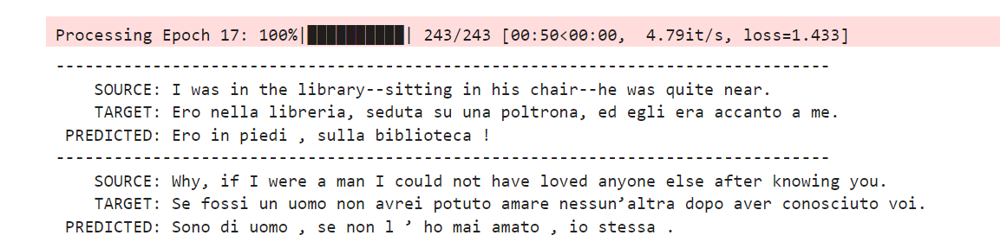

## This is the ERA V2 Assignment 18
# The objective of this assignment is 

i) Pick the "en-it" dataset from opus_books

ii) Train your own transformer (E-D) (do anything you want, use PyTorch, OCP, PS, AMP, etc)

iii) Target loss = <1.8, Max epochs = 18

When we train our model of assignment 17, the training time was very high, so in this assignment we optimized our solution to speed up the training time and to bring our loss even much lesser than the previous assignment solution
We have used
AMP (Automatic Mixed Precision): It speeds up training by leveraging both FP16 and FP32 data types, ensuring minimal loss in model accuracy.
Dynamic Padding: Sequences in each batch are padded dynamically to the length of the longest sequence in that batch, reducing computational overhead.
One Cycle Policy (OCP): A learning rate scheduling technique that enables faster convergence and potentially better model outcomes.

