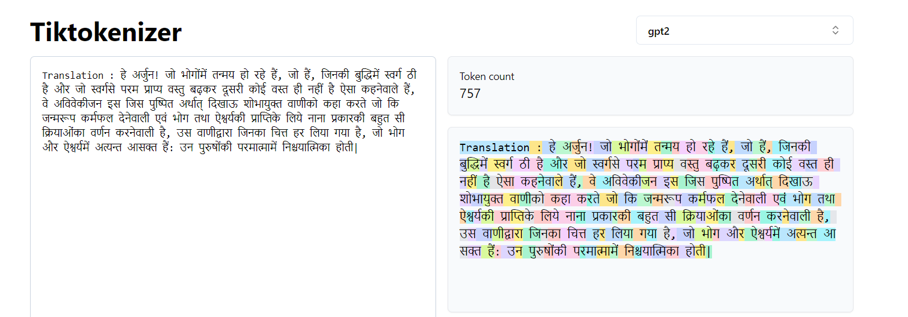
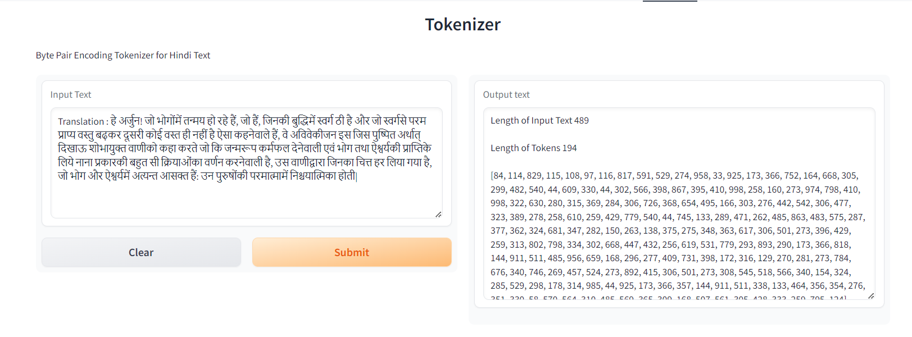

## This is the Tokenizer Project Assignment as part of ERA V2 Session 20

## For this assignment, 
  1) Pick any "Indian" language of your choice
  2) Build your own BPE for this language that satisfies these statistics:
    i) it must have 5000+ tokens in its vocabulary
    ii) it must have a compression ratio of 3 or above

## In this we build a tokenizer for the Hindi language from scratch.

#### Tokenization is a preprocessing technique in natural language processing (NLP) that converts text to structured data so a computer can understand human language. It breaks down unstructured text data into smaller units called tokens.

#### To build this tokenizer, i have used Bhagavad Geeta Hindi Dataset. I got this dataset in raw form. So, have done some preprocessing to build some cleaner dataset

### Below is some the examples of dataset

```
Chapter 1 Shlok 1
Translation : धृतराष्ट्र बोले- हे संजय! धर्मभूमि कुरुक्षेत्र में एकत्रित, युद्ध की इच्छावाले मेरे और पाण्डु के पुत्रों ने क्या किया?
Commentary : 'धर्मक्षेत्रे' 'कुरुक्षेत्रे'-- कुरुक्षेत्र में देवताओं ने यज्ञ किया था। राजा कुरु ने भी यहाँ तपस्या की थी। यज्ञादि धर्ममय कार्य होने से तथा राजा कुरु की तपस्याभूमि होने से इसको धर्मभूमि कुरुक्षेत्र कहा गया है। यहाँ ॓'धर्मक्षेत्रे' और 'कुरुक्षेत्रे' पदों में 'क्षेत्र' शब्द देने में धृतराष्ट्र का अभिप्राय है कि यह अपनी कुरुवंशियों की भूमि है। यह केवल लड़ाई की भूमि ही नहीं है, प्रत्युत तीर्थभूमि भी है, जिसमें प्राणी जीते-जी पवित्र कर्म करके अपना कल्याण कर सकते हैं। इस तरह लौकिक और पारलौकिक सब तरह का लाभ हो जाय-- ऐसा विचार करके एवं श्रेष्ठ पुरुषों की सम्मति लेकर ही युद्ध के लिये यह भूमि चुनी गयी है। संसार में प्रायः तीन बातों को लेकर लड़ाई होती है-- भूमि, धन और स्त्री। इस तीनों में भी राजाओं का आपस में लड़ना मुख्यतः जमीन को लेकर होता है। यहाँ 'कुरुक्षेत्रे' पद देने का तात्पर्य भी जमीन को लेकर ल़ड़ने में है। कुरुवंश में धृतराष्ट्र और पाण्डु के पुत्र सब एक हो जाते हैं। कुरुवंशी होने से दोनों का कुरुक्षेत्र में अर्थात् राजा कुरु की जमीन पर समान हक लगता है। इसलिये (कौरवों द्वारा पाण्डवों को उनकी जमीन न देने के कारण) दोनों जमीन के लिये लड़ाई करने आये हुए हैं। यद्यपि अपनी भूमि होने के कारण दोनों के लिये 'कुरुक्षेत्रे' पद देना युक्तिसंगत, न्यायसंगत है, तथापि हमारी सनातन वैदिक संस्कृति ऐसी विलक्षण है कि कोई भी कार्य करना होता है, तो वह धर्म को सामने रखकर ही होता है। युद्ध-जैसा कार्य भी धर्मभूमि-- तीर्थभूमि में ही करते हैं, जिससे युद्ध में मरने वालों का उद्धार हो जाय, कल्याण हो जाय। अतः यहाँ कुरुक्षेत्र के साथ 'धर्मक्षेत्रे' पद आया है। यहाँ आरम्भ में 'धर्म' पद से एक और बात भी मालूम होती है। अगर आरम्भ के 'धर्म' पद में से 'धर्' लिया जाय और अठारहवें अध्याय के अन्तिम श्लोक के 'मम' पदों से 'म' लिया जाय, तो 'धर्म' शब्द बन जाता है। अतः सम्पूर्ण गीता धर्म के अन्तर्गत है अर्थात् धर्म का पालन करने से गीता के सिद्धान्तों का पालन हो जाता है और गीता के सिद्धान्तों के अनुसार कर्तव्य कर्म करने से धर्म का अनुष्ठान हो जाता है। इन 'धर्मक्षेत्रे कुरुक्षेत्रे' पदों से सभी मनुष्यों को यह शिक्षा लेनी चाहिये कि कोई भी काम करना हो तो वह धर्म को सामने रखकर ही करना चाहिये। प्रत्येक कार्य सबके हित की दृष्टि से ही करना चाहिये, केवल अपने सुख-आराम-की दृष्टि से नहीं; और कर्तव्य-अकर्तव्य के विषय में शास्त्र को सामने रखना चाहिये (गीता 16। 24)। 'समवेता युयुत्सवः'-- राजाओं के द्वारा बारबार सन्धि का प्रस्ताव रखने पर भी दुर्योधन ने सन्धि करना स्वीकार नहीं किया। इतना ही नहीं, भगवान् श्रीकृष्ण के कहने पर भी मेरे पुत्र दुर्योधन ने स्पष्ट कह दिया कि बिना युद्ध के मैं तीखी सूई की नोक-जितनी जमीन भी पाण्डवों को नहीं दूँगा। (टिप्पणी प0 2.1) तब मजबूर होकर पाण्डवों ने भी युद्ध करना स्वीकार किया है। इस प्रकार मेरे पुत्र और पाण्डुपुत्र-- दोनों ही सेनाओं के सहित युद्ध की इच्छा से इकट्ठे हुए हैं। दोनों सेनाओं में युद्ध की इच्छा रहने पर भी दुर्योधन में युद्ध की इच्छा विशेषरूप से थी। उसका मुख्य उद्देश्य राज्य-प्राप्ति का ही था। वह राज्य-प्राप्ति धर्म से हो चाहे अधर्म से, न्याय से हो चाहे अन्याय से, विहित रीति से हो चाहे निषिद्ध रीति से, किसी भी तरह से हमें राज्य मिलना चाहिये-- ऐसा उसका भाव था। इसलिये विशेषरूप से दुर्योधन का पक्ष ही युयुत्सु अर्थात् युद्ध की इच्छावाला था। पाण्डवों में धर्म की मुख्यता थी। उनका ऐसा भाव था कि हम चाहे जैसा जीवन-निर्वाह कर लेंगे, पर अपने धर्म में बाधा नहीं आने देंगे, धर्म के विरुद्ध नहीं चलेंगे। इस बात को लेकर महाराज युधिष्ठिर युद्ध नहीं करना चाहते थे। परन्तु जिस माँ की आज्ञा से युधिष्ठिर ने चारों भाइयों सहित द्रौपदी से विवाह किया था, उस माँ की आज्ञा होने के कारण ही महाराज युधिष्ठिर की युद्ध में प्रवृत्ति हुई थी (टिप्पणी प0 2.2) अर्थात् केवल माँ के आज्ञा-पालनरूप धर्म से ही युधिष्ठिर युद्ध की इच्छावाले हुये हैं। तात्पर्य है कि दुर्योधन आदि तो राज्य को लेकर ही युयुत्सु थे, पर पाण्डव धर्म को लेकर ही युयुत्सु बने थे। 'मामकाः पाण्डवाश्चैव'-- पाण्डव धृतराष्ट्र को (अपने पिता के बड़े भाई होने से) पिता के समान समझते थे और उनकी आज्ञा का पालन करते थे। धृतराष्ट्र के द्वारा अनुचित आज्ञा देने पर भी पाण्डव उचित-अनुचित का विचार न करके उनकी आज्ञा का पालन करते थे। अतः यहाँ 'मामकाः' पद के अन्तर्गत कौरव (टिप्पणी प0 3.1) और पाण्डव दोनों आ जाते हैं। फिर भी 'पाण्डवाः' पद अलग देने का तात्पर्य है कि धृतराष्ट्र का अपने पुत्रों में तथा पाण्डुपुत्रों में समान भाव नहीं था। उनमें पक्षपात था,अपने पुत्रों के प्रति मोह था। वे दुर्योधन आदि को तो अपना मानते थे, पर पाण्डवों को अपना नहीं मानते थे। (टिप्पणी प0 3.2) इस कारण उन्होंने अपने पुत्रों के लिये 'मामकाः' और पाण्डुपुत्रों के लिये 'पाण्डवा' पद का प्रयोग किया है; क्योंकि जो भाव भीतर होते हैं, वे ही प्रायः वाणी से बाहर निकलते हैं। इस द्वैधीभाव के कारण ही धृतराष्ट्र को अपने कुल के संहार का दुःख भोगना पड़ा। इससे मनुष्यमात्र को यह शिक्षा लेनी चाहिये कि वह अपने घरों में, मुहल्लों में, गाँवों में, प्रान्तों में, देशों में, सम्प्रदायों में द्वैधीभाव अर्थात् ये अपने हैं, ये दूसरे हैं-- ऐसा भाव न रखे। कारण कि द्वैधीभाव से आपस में प्रेम, स्नेह नहीं होता, प्रत्युत कलह होती है। यहाँ 'पाण्डवाः' पद के साथ 'एव' पद देने का तात्पर्य है कि पाण्डव तो बड़े धर्मात्मा हैं; अतः उन्हें युद्ध नहीं करना चाहिये था। परन्तु वे भी युद्ध के लिये रणभूमि में आ गये तो वहाँ आकर उन्होंने क्या किया? 'मामकाः' और 'पाण्डवाः' (टिप्पणी प0 3.3) इनमें से पहले 'मामकाः' पद का उत्तर सञ्जय आगे के (दूसरे) श्लोक से तेरहवें श्लोक तक देंगे कि आपके पुत्र दुर्योधन ने पाण्डवों की सेना को देखकर द्रोणाचार्य के मन में पाण्डवों के प्रति द्वेष पैदा करने के लिये उनके पास जाकर पाण्डवों के मुख्य-मुख्य सेनापतियों के नाम लिये। उसके बाद दुर्योधन ने अपनी सेना के मुख्य-मुख्य योद्धाओं के नाम लेकर उनके रण-कौशल आदि की प्रशंसा की। दुर्योधन को प्रसन्न करने के लिये भीष्मजी ने जोर से शंख बजाया। उसको सुनकर कौरव-सेना में शंख आदि बाजे बज उठे। फिर चौदहवें श्लोक से उन्नीसवें श्लोक तक 'पाण्डवाः' पद का उत्तर देंगे कि रथ में बैठे हुए पाण्डवपक्षीय श्रीकृष्ण ने शंख बजाया। उसके बाद अर्जुन, भीम, युधिष्ठिर, नकुल, सहदेव आदि ने अपने-अपने शंख बजाये, जिससे दुर्योधन की सेना का हृदय दहल गया। उसके बाद भी सञ्जय पाण्डवों की बात कहते-कहते बीसवें श्लोक से श्रीकृष्ण और अर्जुन के संवाद का प्रसङ्ग आरम्भ कर देंगे। 'किमकुर्वत'-- 'किम्' शब्द के तीन अर्थ होते हैं-- विकल्प, निन्दा (आक्षेप) और प्रश्न। युद्ध हुआ कि नहीं? इस तरह का विकल्प तो यहाँ लिया नहीं जा सकता; क्योंकि दस दिन तक युद्ध हो चुका है और भीष्म जी को रथ से गिरा देने के बाद सञ्जय हस्तिनापुर आकर धृतराष्ट्र को वहाँ की घटना सुना रहे हैं। 'मेरे और पाण्डु के पुत्रों ने यह क्या किया, जो कि युद्ध कर बैठे! उनको युद्ध नहीं करना चाहिये था'-- ऐसी निन्दा या आक्षेप भी यहाँ नहीं लिया जा सकता; क्योंकि युद्ध तो चल ही रहा था और धृतराष्ट्र के भीतर भी आक्षेपपूर्वक पूछने का भाव नहीं था। यहाँ 'किम्' शब्द का अर्थ प्रश्न लेना ही ठीक बैठता है। धृतराष्ट्र सञ्जय से भिन्न-भिन्न प्रकार की छोटी-बड़ी सब घटनाओं को अनुक्रम से विस्तारपूर्वक ठीक-ठीक जानने के लिये ही प्रश्न कर रहे हैं। सम्बन्ध-- धृतराष्ट्र के प्रश्न का उत्तर सञ्जय आगे के श्लोक से देना आरम्भ करते हैं।

Chapter 1 Shlok 2
Translation : संजय बोले- उस समय राजा दुर्योधन ने व्यूहरचनायुक्त पाण्डवों की सेना को देखा और द्रोणाचार्य के पास जाकर यह वचन कहा|
Commentary : 'तदा'-- जिस समय दोनों सेनाएँ युद्धके लिये खड़ी हुई थीं, उस समयकी बात सञ्जय यहाँ 'तदा' पदसे कहते हैं। कारण कि धृतराष्ट्रका प्रश्न 'युद्धकी इच्छावाले मेरे और पाण्डुके पुत्रोंने क्या किया'-- इस विषयको सुननेके लिये ही है। 'तु'--धृतराष्ट्रने अपने और पाण्डुके पुत्रोंके विषयमें पूछा है। अतः सञ्जय भी पहले धृतराष्ट्रके पुत्रों की बात बतानेके लिये यहाँ  'तु'  पदका प्रयोग करते हैं।

Chapter 1 Shlok 3
Translation : हे आचार्य! आपके बुद्धिमान्‌ शिष्य द्रुपदपुत्र धृष्टद्युम्न द्वारा व्यूहाकार खड़ी की हुई पाण्डुपुत्रों की इस बड़ी भारी सेना को देखिए|
Commentary : 'आचार्य' द्रोणके लिये 'आचार्य' सम्बोधन देनेमें दुर्योधनका यह भाव मालूम देता है कि आप हम सबके--कौरवों और पाण्डवों के आचार्य हैं। शस्त्रविद्या सिखानेवाले होनेसे आप सबके गुरु हैं। इसलिये आपके मनमें किसीका पक्ष या आग्रह नहीं होना चाहिये। 'तव शिष्येण धीमता'--इन पदोंका प्रयोग करनेमें दुर्योधनका भाव यह है कि आप इतने सरल हैं कि अपने मारनेके लिये पैदा होनेवाले धृष्टद्युम्नको भी आपने अस्त्र-शस्त्रकी विद्या सिखायी है; और वह आपका शिष्य धृष्टद्युम्न इतना बुद्धिमान है कि उसने आपको मारनेके लिये आपसे ही अस्त्र-शस्त्रकी विद्या सीखी है। वास्तव में दुर्योधन की यह मूर्खता है कि वह द्रोणाचार्य को पाण्डवों की सैन्य रचना के विषय में विस्तार से बताये। आगे हम देखेंगे कि वह आवश्यकता से अधिक बातें करता है जो युद्ध के परिणाम के विषय में उसके संदेह का स्पष्ट लक्षण है।

Chapter 1 Shlok 4, 5 and 6
Translation : इस सेना में बड़े-बड़े धनुषों वाले तथा युद्ध में भीम और अर्जुन के समान शूरवीर सात्यकि और विराट तथा महारथी राजा द्रुपद, धृष्टकेतु और चेकितान तथा बलवान काशिराज, पुरुजित, कुन्तिभोज और मनुष्यों में श्रेष्ठ शैब्य, पराक्रमी युधामन्यु तथा बलवान उत्तमौजा, सुभद्रापुत्र अभिमन्यु एवं द्रौपदी के पाँचों पुत्र- ये सभी महारथी हैं| धृष्टकेतु, चेकिताना, और काशी के बहादुर राजा, पुरुजीत और कुंतीभोज और सैब्य, सबसे अच्छे पुरुष। बलवान युधमन्यु और वीर उत्तमौज, सुभद्रा के पुत्र और द्रौपदी के पुत्र, वे सभी, मंडल सेनापति।
Commentary : 'अत्र शूरा महेष्वासा भीमार्जुनसमा युधि'--जिनसे बाण चलाये जाते हैं, फेंके जाते हैं, उनका नाम 'इष्वास' अर्थात् धनुष है। ऐसे बड़े-बड़े इष्वास (धनुष) जिनसे पास हैं, वे सभी 'महेष्वास' हैं। तात्पर्य है कि बड़े धनुषोंपर बाण चढ़ाने एवं प्रत्यञ्चा खींचनेमें बहुत बल लगता है। जोरसे खींचकर छोड़ा गया बाण विशेष मार करता है। ऐसे बड़े-बड़े धनुष पासमें होनेके कारण ये सभी बहुत बलवान् और शूरवीर हैं। ये मामूली योद्धा नहीं हैं। युद्धमें ये भीम और अर्जुनके समान हैं अर्थात् बलमें ये भीमके समान और अस्त्र-शस्त्रकी कलामें ये अर्जुनके समान हैं। इन तीन श्लोकों में पाण्डवसैन्य के प्रमुख एवं प्रसिद्ध योद्धाओं की नामावली है। पाण्डवों की सेना का निरीक्षण करते समय दुर्योधन उनमें अनेक महारथियों को पहचानता है। प्राचीन हिन्दू सेनाओं में 11000 धनुर्धारी सैनिकों के समूह के नायक को महारथी कहा जाता था।अर्जुन और भीम अपने समय के धनुर्विद्या और शक्ति के लिये प्रसिद्ध योद्धा थे। दुर्योधन कहता है कि सभी महारथी अर्जुन और भीम के समान हैं जिसका तात्पर्य यह है कि यद्यपि पाण्डवों की सेना संख्या में कम थी परन्तु सार्मथ्य में वह कौरवों की सुसज्जित और विशाल सेना से अधिक थी।

Chapter 1 Shlok 7
Translation : हे ब्राह्मणश्रेष्ठ ! अपने पक्ष में भी जो प्रधान हैं, उनको आप समझ लीजिये । आपकी जानकारी के लिये मेरी सेना के जो-जो सेनापति हैं, उनको बतलाता हूँ ।
Commentary : 'अस्माकं तु विशिष्टा ये तान्निबोध द्विजोत्तम'-- दुर्योधन द्रोणाचार्यसे कहता है कि हे द्विजश्रेष्ठ! जैसे पाण्डवोंकी सेनामें श्रेष्ठ महारथी हैं, ऐसे ही हमारी सेनामें भी उनसे कम विशेषतावाले महारथी नहीं हैं प्रत्युत उनकी सेनाके महारथियोंकी अपेक्षा ज्यादा ही विशेषता रखनेवाले हैं। उनको भी आप समझ लीजिये। तीसरे श्लोकमें 'पश्य' और यहाँ  'निबोध'  क्रिया देनेका तात्पर्य है कि पाण्डवोंकी सेना तो सामने खड़ी है, इसलिये उसको देखनेके लिये दुर्योधन  'पश्य'  (देखिये) क्रियाका प्रयोग करता है। परन्तु अपनी सेना सामने नहीं है अर्थात् अपनी सेनाकी तरफ द्रोणाचार्यकी पीठ है, इसलिये उसको देखनेकी बात न कहकर उसपर ध्यान देनेके लिये दुर्योधन 'निबोध' (ध्यान दीजिये) क्रियाका प्रयोग करता है। 'नायका मम सैन्यस्य संज्ञार्थं तान्ब्रवीमि ते'-- मेरी सेनामें भी जो विशिष्टविशिष्ट सेनापति हैं सेनानायक हैं महारथी हैं, मैं उनके नाम केवल आपको याद दिलानेके लिये, आपकी दृष्टि उधर खींचनेके लिये ही कह रहा हूँ। संज्ञार्थम् पदका तात्पर्य है कि हमारे बहुत-से सेनानायक हैं उनके नाम मैं कहाँतक कहूँ; इसलिये मैं उनका केवल संकेतमात्र करता हूँ; क्योंकि आप तो सबको जानते ही हैं। इस श्लोकमें दुर्योधनका ऐसा भाव प्रतीत होता है कि हमारा पक्ष किसी भी तरह कमजोर नहीं है। परन्तु राजनीतिके अनुसार शत्रुपक्ष चाहे कितना ही कमजोर हो और अपना पक्ष चाहे कितना ही सबल हो, ऐसी अवस्थामें भी शत्रुपक्षको कमजोर नहीं समझना चाहिये और अपनेमें उपेक्षा, उदासीनता आदिकी भावना किञ्चिन्मात्र भी नहीं आने देनी चाहिये। इसलिये सावधानीके लिये मैंने उनकी सेनाकी बात कही और अब अपनी सेनाकी बात कहता हूँ। दूसरा भाव यह है कि पाण्डवोंकी सेनाको देखकर दुर्योधनपर बड़ा प्रभाव पड़ा और उसके मनमें कुछ भय भी हुआ। कारण कि संख्यामें कम होते हुए भी पाण्डव-सेनाके पक्षमें बहुत-से धर्मात्मा पुरुष थे और स्वयं भगवान् थे। जिस पक्षमें धर्म और भगवान् रहते हैं, उसका सबपर बड़ा प्रभाव पड़ता है। पापी-से-पापी, दुष्ट-से-दुष्ट व्यक्तिपर भी उसका प्रभाव पड़ता है। इतना ही नहीं, पशु-पक्षी वृक्ष-लता आदिपर भी उसका प्रभाव पड़ता है। कारण कि धर्म और भगवान् नित्य हैं। कितनी ही ऊँची-से-ऊँची भौतिक शक्तियाँ क्यों न हों, हैं वे सभी अनित्य ही। इसलिये दुर्योधनपर पाण्डव-सेनाका बड़ा असर पड़ा। परन्तु उसके भीतर भौतिक बलका विश्वास मुख्य होनेसे वह द्रोणाचार्यको विश्वास दिलानेके लिये कहता है कि हमारे पक्षमें जितनी विशेषता है, उतनी पाण्डवोंकी सेनामें नहीं है। अतः हम उनपर सहज ही विजय कर सकते हैं। द्रोणाचार्य को द्विजोत्तम कहकर सम्बोधित करते हुये दुर्योधन अपनी सेना के प्रमुख वीर योद्धाओं के नाम सुनाता है। एक कायर मनुष्य अंधेरे में अनुभव होने वाले भय को दूर करने के लिये सीटी बजाता है अथवा कुछ गुनगुनाने लगता है। दुर्योधन की स्थिति भी कुछ इसी प्रकार की थी। अपराधबोध से पीड़ित अत्याचारी दुर्योधन की मनस्थिति बिखर रही थी। यद्यपि उसकी सेना सक्षम शूरवीरों से सुसज्जित थी तथापि शत्रुपक्ष के वीरों को देखकर उसे भय लग रहा था। अत द्रोणाचार्य के मुख से स्वयं को प्रोत्साहित करने वाले शब्दों को वह सुनना चाहता था। परन्तु जब वह आचार्य के पास पहुँचा तब वे शान्त और मौन रहे। इसलिये टूटत्ो उत्साह को फिर से जुटाने के लिये वह अपनी सेना के प्रमुख योद्धाओं के नाम गिनाने लगता है।यह स्वाभाविक है कि अपराधबोध के भार से दबा हुआ व्यक्ति नैतिक बल के अभाव में सम्भाषणादि की मर्यादा को भूलकर अत्यधिक बोलने लगता है। ऐसे मानसिक तनाव के समय व्यक्ति के वास्तविक संस्कार उजागर होते हैं। यहाँ दुर्योधन अपने गुरु को द्विजोत्तम कहकर सम्बोधित करता है। आन्तरिक ज्ञान के विकास के कारण ब्राह्मण को द्विज (दो बार जन्मा हुआ) कहा जाता है। माता के गर्भ से जन्म लेने पर मनुष्य संस्कारहीन होने के कारण पशुतुल्य ही होता है। संस्कार एवं अध्ययन के द्वारा वह एक शिक्षित व सुसंस्कृत पुरुष बनता है। यह उसका दूसरा जन्म माना जाता है। यह द्विज शब्द का अर्थ है। द्रोणाचार्य ब्राह्मण कुल में जन्में थे और स्वभावत उनमें हृदय की कोमलता आदि श्रेष्ठ गुण थे। पाण्डव सैन्य में उनके प्रिय शिष्य ही उपस्थित थे। यह सब जानकर चतुर किन्तु निर्लज्ज दुर्योधन को अपने गुरु की निष्पक्षता पर भी संदेह होने लगा था। जब हमारे उद्देश्य पापपूर्ण और कुटिलता से भरे होते हैं तब हम अपने समीपस्थ और अधीनस्थ लोगों में भी उन्हीं अवगुणों की कल्पना करने लगते हैं।

```

## Results we achieved

```
length of text: 3218403
length of tokens: 8340297
```

In above we have a tokens of 8340297 which is greater then 5000 token size which was mentioned in assignment goals

```
tokens length: 8340297
ids length: 1267199
compression ratio: 6.58X
```
In above, we get the compression ratio of 6.58 which is greater then 3 compression ratio which was mentioned in assignment goals

#### Below is the tokenizer of hindi text in tiktokenizer platform of open ai. 



As you can see, the total count of token is 757

#### Below is the tokenizer of same hindi text in the code which i build



As you can see, the total count of token for the same text is 194

As OpenAI didn't train much on Hindi language text dataset, so i decided to build the tokenizer for hindi dataset
