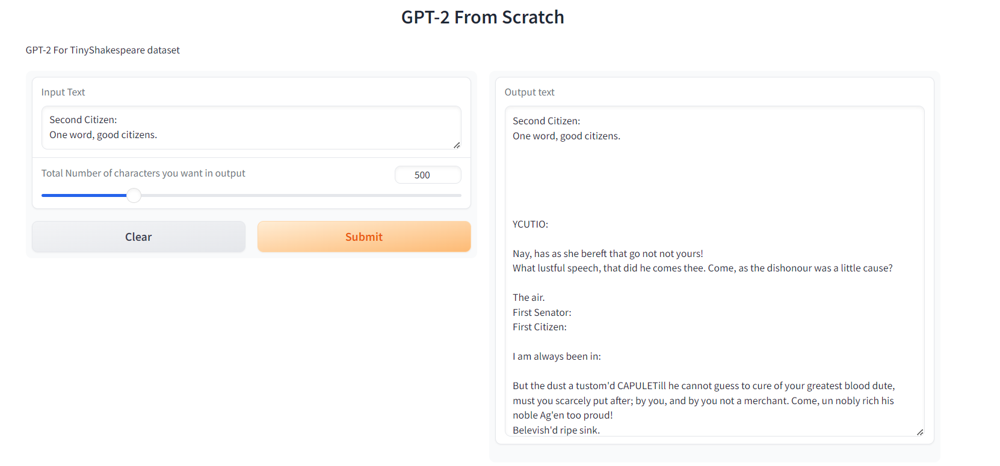

### This is ERA V2 Session 21 Assignment 1

#### In this we have to train gpt-2 model from scratch on TinyShakespeare dataset

### Below is our some training logs

```
step4946 | loss: 0.47739461064338684 | dt: 2028.70ms | tok/sec:  4038.05 | norm: 2.39
step4947 | loss: 0.5272894501686096 | dt: 2030.82ms | tok/sec:  4033.83 | norm: 2.56
step4948 | loss: 0.41561323404312134 | dt: 2026.95ms | tok/sec:  4041.54 | norm: 2.25
step4949 | loss: 0.37637418508529663 | dt: 2040.71ms | tok/sec:  4014.29 | norm: 2.10
step4950 | loss: 0.4168824851512909 | dt: 2024.55ms | tok/sec:  4046.33 | norm: 2.12
step4951 | loss: 0.33780691027641296 | dt: 2041.86ms | tok/sec:  4012.02 | norm: 1.87
step4952 | loss: 0.40891557931900024 | dt: 2029.93ms | tok/sec:  4035.60 | norm: 2.13
step4953 | loss: 0.35638120770454407 | dt: 2033.84ms | tok/sec:  4027.84 | norm: 1.86
step4954 | loss: 0.3275742530822754 | dt: 2024.07ms | tok/sec:  4047.30 | norm: 1.86
step4955 | loss: 0.3568790853023529 | dt: 2020.80ms | tok/sec:  4053.84 | norm: 1.96
step4956 | loss: 0.41094502806663513 | dt: 2026.40ms | tok/sec:  4042.64 | norm: 2.15
step4957 | loss: 0.3223937451839447 | dt: 2033.48ms | tok/sec:  4028.57 | norm: 1.71
step4958 | loss: 0.30656498670578003 | dt: 2031.66ms | tok/sec:  4032.16 | norm: 1.80
step4959 | loss: 0.26275455951690674 | dt: 2034.05ms | tok/sec:  4027.43 | norm: 1.59
step4960 | loss: 0.3816116452217102 | dt: 2036.85ms | tok/sec:  4021.89 | norm: 1.92
step4961 | loss: 0.465545654296875 | dt: 2040.89ms | tok/sec:  4013.94 | norm: 2.20
step4962 | loss: 0.4436395466327667 | dt: 2030.64ms | tok/sec:  4034.21 | norm: 2.08
step4963 | loss: 0.45534566044807434 | dt: 2033.79ms | tok/sec:  4027.94 | norm: 2.10
step4964 | loss: 0.3885959982872009 | dt: 2034.18ms | tok/sec:  4027.17 | norm: 2.04
step4965 | loss: 0.3320291042327881 | dt: 2037.87ms | tok/sec:  4019.88 | norm: 1.91
step4966 | loss: 0.4024321734905243 | dt: 2025.15ms | tok/sec:  4045.13 | norm: 2.21
step4967 | loss: 0.47541293501853943 | dt: 2034.06ms | tok/sec:  4027.41 | norm: 2.37
step4968 | loss: 0.47607120871543884 | dt: 2034.96ms | tok/sec:  4025.63 | norm: 2.27
step4969 | loss: 0.4391465187072754 | dt: 2034.85ms | tok/sec:  4025.85 | norm: 2.47
step4970 | loss: 0.3928200602531433 | dt: 2037.49ms | tok/sec:  4020.64 | norm: 2.23
step4971 | loss: 0.39507797360420227 | dt: 2033.34ms | tok/sec:  4028.84 | norm: 2.13
step4972 | loss: 0.39509648084640503 | dt: 2032.11ms | tok/sec:  4031.28 | norm: 2.22
step4973 | loss: 0.38789865374565125 | dt: 2033.07ms | tok/sec:  4029.38 | norm: 2.17
step4974 | loss: 0.36288341879844666 | dt: 2035.22ms | tok/sec:  4025.12 | norm: 2.09
step4975 | loss: 0.3670407235622406 | dt: 2024.76ms | tok/sec:  4045.92 | norm: 2.13
step4976 | loss: 0.35782113671302795 | dt: 2028.34ms | tok/sec:  4038.77 | norm: 2.03
step4977 | loss: 0.4062246084213257 | dt: 2031.82ms | tok/sec:  4031.85 | norm: 2.15
step4978 | loss: 0.4055003821849823 | dt: 2031.80ms | tok/sec:  4031.89 | norm: 2.21
step4979 | loss: 0.4171215295791626 | dt: 2026.49ms | tok/sec:  4042.45 | norm: 2.16
step4980 | loss: 0.3911503851413727 | dt: 2025.30ms | tok/sec:  4044.82 | norm: 2.18
step4981 | loss: 0.3930116295814514 | dt: 2023.08ms | tok/sec:  4049.27 | norm: 2.20
step4982 | loss: 0.42059797048568726 | dt: 2019.37ms | tok/sec:  4056.71 | norm: 2.20
step4983 | loss: 0.40822091698646545 | dt: 2027.76ms | tok/sec:  4039.92 | norm: 2.11
step4984 | loss: 0.3725118637084961 | dt: 2028.32ms | tok/sec:  4038.81 | norm: 1.92
step4985 | loss: 0.46278494596481323 | dt: 2018.61ms | tok/sec:  4058.25 | norm: 2.31
step4986 | loss: 0.3504970967769623 | dt: 2023.71ms | tok/sec:  4048.00 | norm: 2.04
step4987 | loss: 0.4664233326911926 | dt: 2013.18ms | tok/sec:  4069.19 | norm: 2.44
step4988 | loss: 0.5133973360061646 | dt: 2020.74ms | tok/sec:  4053.97 | norm: 2.46
step4989 | loss: 0.40328577160835266 | dt: 2021.94ms | tok/sec:  4051.55 | norm: 2.24
step4990 | loss: 0.3711134195327759 | dt: 2019.14ms | tok/sec:  4057.17 | norm: 2.41
step4991 | loss: 0.4097849428653717 | dt: 2027.34ms | tok/sec:  4040.75 | norm: 2.35
step4992 | loss: 0.3396194577217102 | dt: 2030.35ms | tok/sec:  4034.78 | norm: 2.11
step4993 | loss: 0.40667423605918884 | dt: 2016.81ms | tok/sec:  4061.85 | norm: 2.20
step4994 | loss: 0.3536892235279083 | dt: 2029.52ms | tok/sec:  4036.42 | norm: 2.19
step4995 | loss: 0.3263743817806244 | dt: 2027.89ms | tok/sec:  4039.67 | norm: 2.17
step4996 | loss: 0.35336530208587646 | dt: 2025.58ms | tok/sec:  4044.27 | norm: 2.12
step4997 | loss: 0.40661942958831787 | dt: 2025.78ms | tok/sec:  4043.87 | norm: 2.26
step4998 | loss: 0.3130512535572052 | dt: 2025.98ms | tok/sec:  4043.48 | norm: 1.75
step4999 | loss: 0.30074870586395264 | dt: 2026.89ms | tok/sec:  4041.66 | norm: 1.92
```

#### For Batch size of 8 and steps of 5000 i acheived max loss of 0.300
```
tensor(0.3007, device='cuda:0', grad_fn=<NllLossBackward0>)
```

#### Below is the inference output on juypter notebook


#### Below is the sample output images for the Hugging face app



