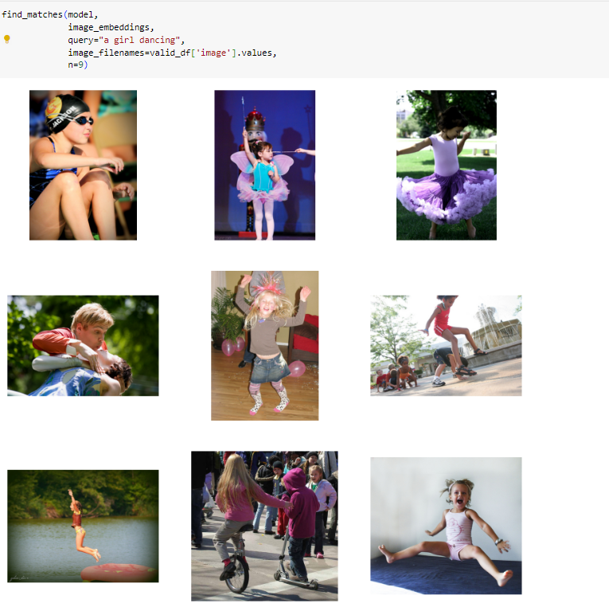
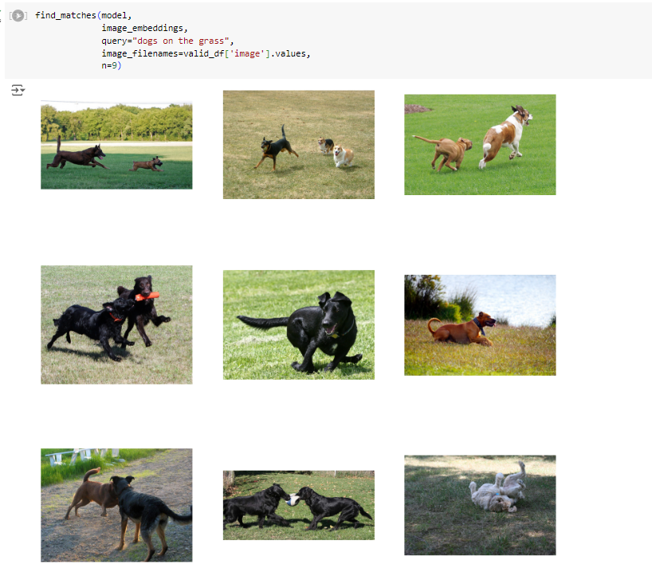
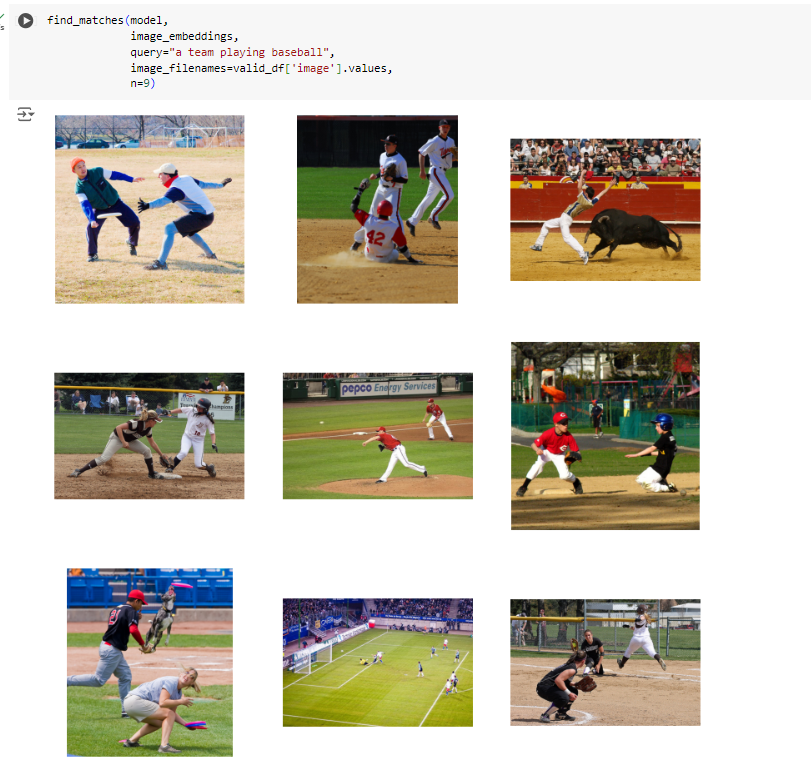

Check out the configuration reference at https://huggingface.co/docs/hub/spaces-config-reference

### This is ERA V2 Session 23 Assignment 23

### Our task was to create CLIP( Contrastive Language-Image Pre-training) models
CLIP is Contrastive Language-Image Pre-training. 
In a nutshell, this model learns the relationship between a whole sentence and the image it describes; in a sense that when the model is trained, given an input sentence it will be able to retrieve the most related images corresponding to that sentence. The important thing here is that it is trained on full sentences instead of single classes like car, dog, etc. The intuition is that when trained on whole sentences, the model can learn a lot more things and finds some pattern between images and texts. They also show that when this model is trained on a huge dataset of images and their corresponding texts, it can also act as a classifier too.

Below is the outputs of the CLIP models

