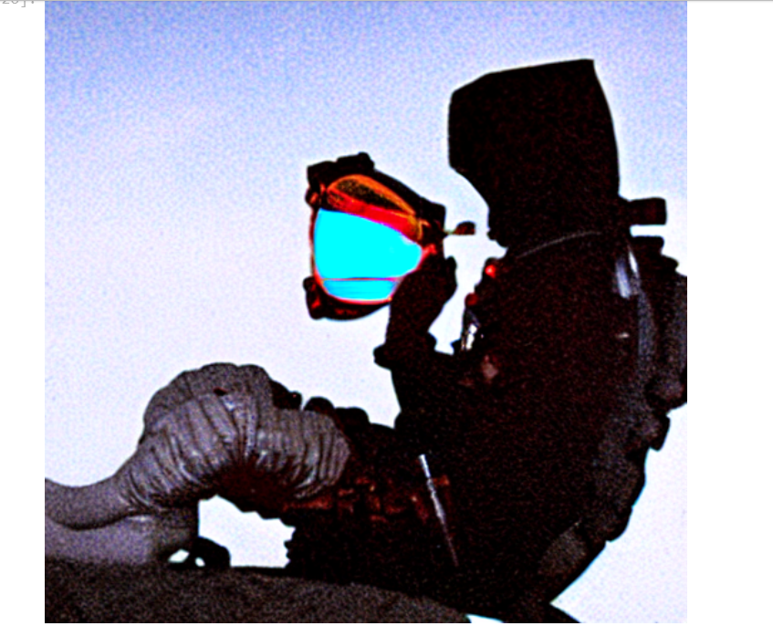

### This is ERA V2 Session 24 Assignment 24

### Our task was to create Stable Diffusion Models with below customization

1. select 5 different styles of your choice and show output for the same prompt using these 5 different styles. Remember the seeds as you'll use them later. Keep seeds different for each 5 types.
2. now apply your own variant of "blue_loss" (it cannot be red, green, or blue loss) on the same prompts with each concept library and store the results.
Below is the outputs of the CLIP models

For prompt = 'man sipping wine in spacesuit on moon in style of s'
1. style = bird_style, seed = 20
   


2. style="captain-haddock", seed = 25


3. style="doc", seed = 30
 


4. style="blue hair boy", seed = 35
 


5. style="fireworks-over-water", seed = 40
 


# The 2nd task was to change the blue loss func and to generate the images with above same prompt, style and seeds
The changed blue loss func code is given below

```
def blue_loss(images):
    variance = torch.var(images)
    return -variance
```

1. style = bird_style, seed = 20



2. style="captain-haddock", seed = 25


3. style="doc", seed = 30


4. style="blue hair boy", seed = 35


5. style="fireworks-over-water", seed = 40


## I have deployed this on hugging face app also. Below is the output on hugging face


