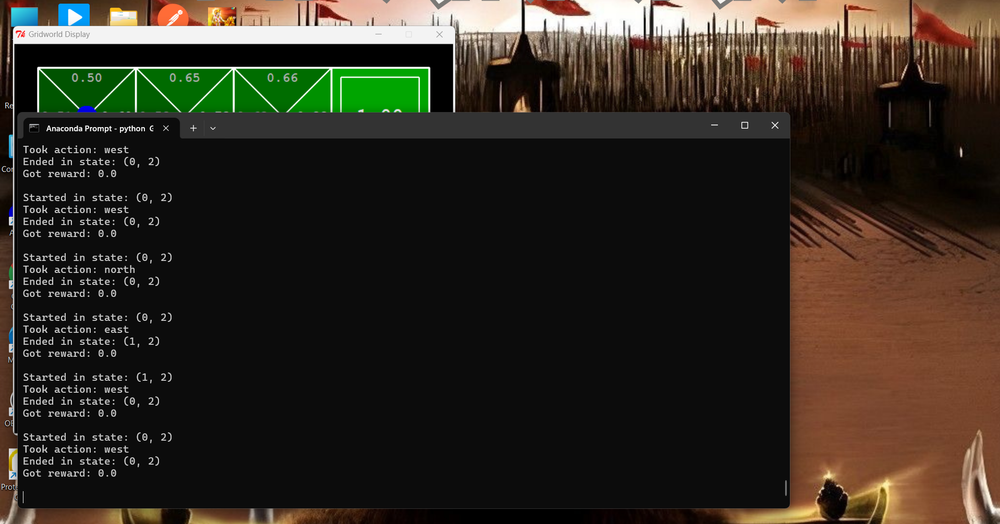
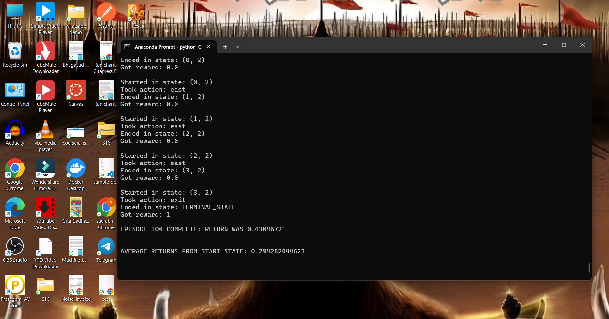

# This is ERA V2 Assignment 26

# Assignment 1 : Q-Learning Grid World

Peusdo code
1) init
   - Pseudo code for Initialization of the Q-learning agent
   i)  Call the parent class constructor with the given arguments
          - This sets up any parameters or initial configurations from the parent class
   ii) Initialize the Q-values:
          - Create a data structure (like a dictionary) to store the Q-values for state-action pairs
          - Set all initial Q-values from Counter class from util file

2) getQValue
     - Pseudo code for getting the values of the Q-learning agent
     - we are getting the q learning agent values from state and action

3) computeValueFromQValue
     - Get all legalactions based on current state
     - If legalactions is empty then return 0.0
     - Loop via legalactions and get Q-Learning agent values and find the maximum value from it
  
4) computeActionFromQValues
      - Get all legalactions based on current state
      - If not actions then return None
      - Installize the max_q_value
      - Lopp via actions and get Q-learning agent value and compare the q_value with max_q_value and if q_value is greater then replace max_q_value with q_value
             and replace best_action with the action
      - Return the best action
  
5) getAction
      - Get legal action based on current state
      - Use flipcoin method implemented in util.py which returns True with probability p and False with probability 1-p
      - If action is True then take random choice from legalactions and if action is False then get use getPolicy method to compute the action from Q values

6) update
     - Here we will update the Q-Learning func
     - The formula for Q-learning update is
     - Q(state, action) = (1 - self.alpha ) + self.alpha * ( reward + self.discount * self.getValue(nextState))
          - 1. First we will find the old_value of q by using self.getQValue(state, action)
          - 2. Then we will find the new_value of q by putting all the values in Q-Learning method
          - 3. Once we get the new_value of q then we will update the self.q_values[(state, action )] with the new_value we get in first 2nd step
           
# Assignment 2 : Car Simulation
