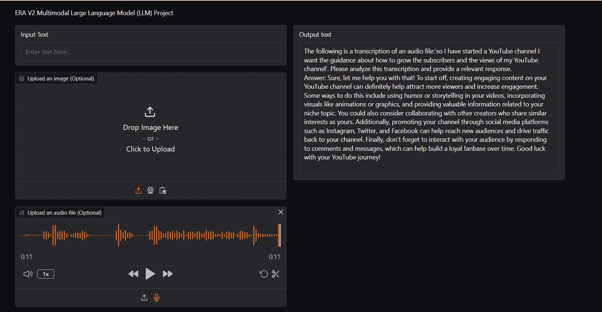
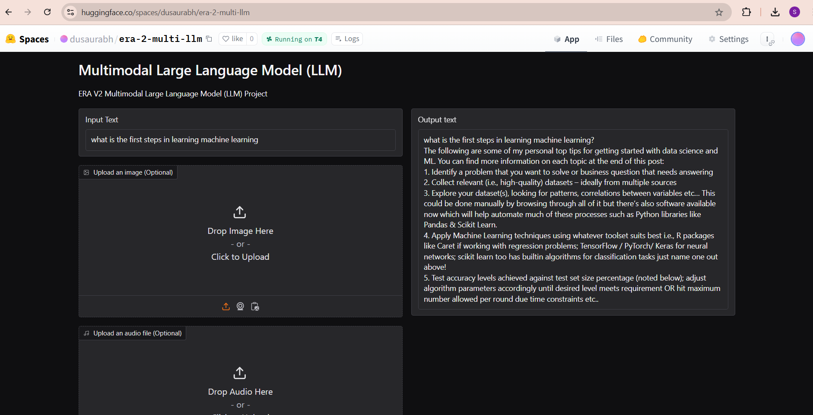
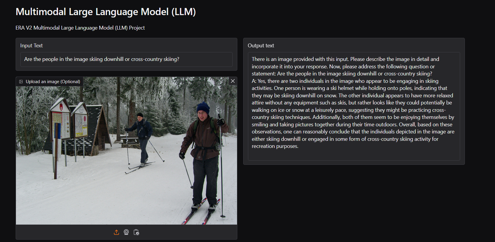
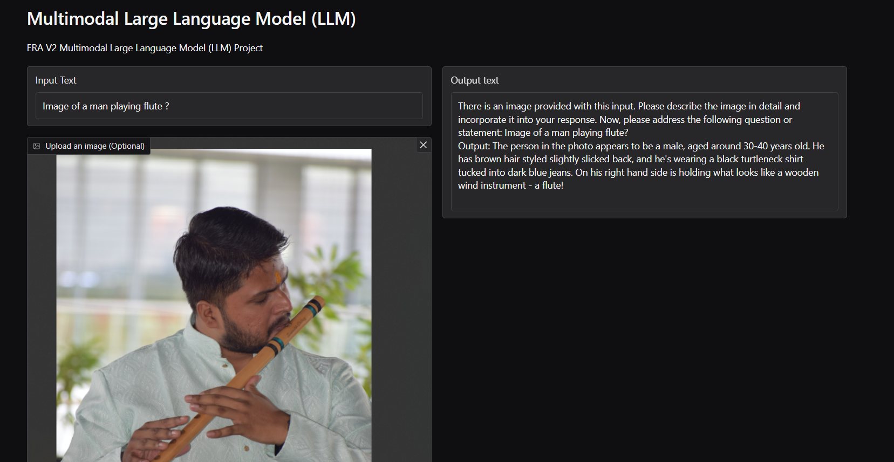
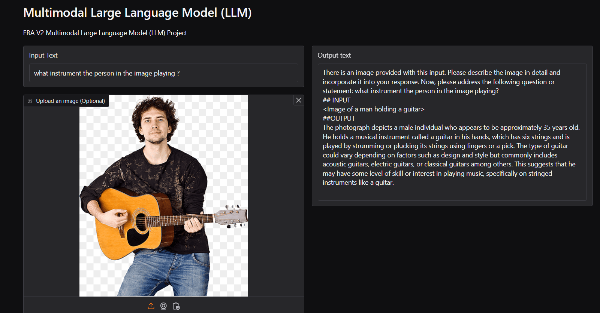

# ERA V2 Multi-Modal Large Language Model (LLM)

Welcome to the ERA V2 Multi-Modal Large Language Model (LLM) project! This model is designed to handle various types of input data — text, images, and audio — to provide contextual and informative responses. Built upon Microsoft’s Phi-2 model and enhanced with fine-tuning on the LLaVA Instruct-150k dataset, this multi-modal LLM brings together the power of language and visual comprehension to respond to complex queries in diverse formats

### Features
Text Input: Traditional text-based question answering and text generation.

Image Input: Visual question answering, where the model can interpret and respond to image-based queries.

Audio Input: Speech-to-text functionality that transcribes audio files and uses the transcription as input for generating responses.

Fine-Tuned with LLaVA: Trained on the LLaVA Instruct-150k dataset, enhancing visual and conversational understanding.

### Setup
#### Prerequisites
Python 3.8+

Hugging Face Transformers

Gradio

Whisper for speech-to-text

Additional dependencies can be installed from requirements.txt

### Installation
```
git clone https://huggingface.co/spaces/dusaurabh/era-2-multi-llm.git
cd era-2-multi-llm
pip install -r requirements.txt
```

### Usage
#### Running the Gradio App
```
python app.py
```

### Model Inference
The model accepts three input types:

1. Text: Enter your question in the textbox.
2. Image: Upload an image for visual question answering.
3. Audio: Upload an audio file for transcription and further processing.
   
Example usage in Gradio app:

1. Input Text: "What is a large language model?"
2. Upload Image: Picture of a landmark (to ask questions about the landmark)
3. Upload Audio: Recording of a question (the audio will be transcribed and processed)

### Some sample outputs

#### Audio Input



#### Text Input



#### Text + Image Input








### Training
This project uses the LLaVA Instruct-150k dataset for multi-modal learning.

Dataset Preprocessing
Text and Image Tokenization: Tokenize questions, answers, and process images to embeddings.
Batch Processing: Process images, questions, and answers in batches, utilizing an A100 GPU for efficiency.  Due to budget constraint, i trained this model for 1 epoch only and due to this you can see the inaccurate results some of the time

For Training - I have used A100 90 GB server from paperspace and it took 24 hours for 1 epoch training

### Future Work
Expand Dataset: Incorporate additional multi-modal datasets for broader knowledge and versatility.

Enhanced Visual Capabilities: Integrate advanced visual question answering datasets.
